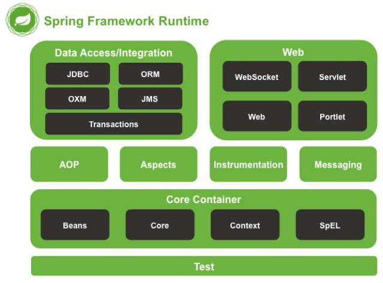
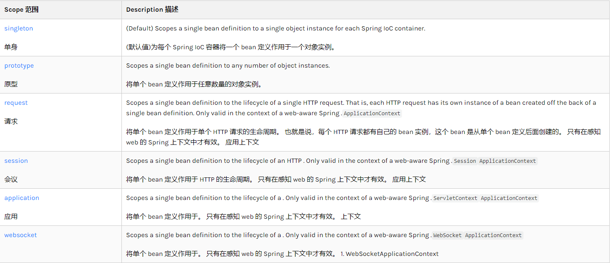
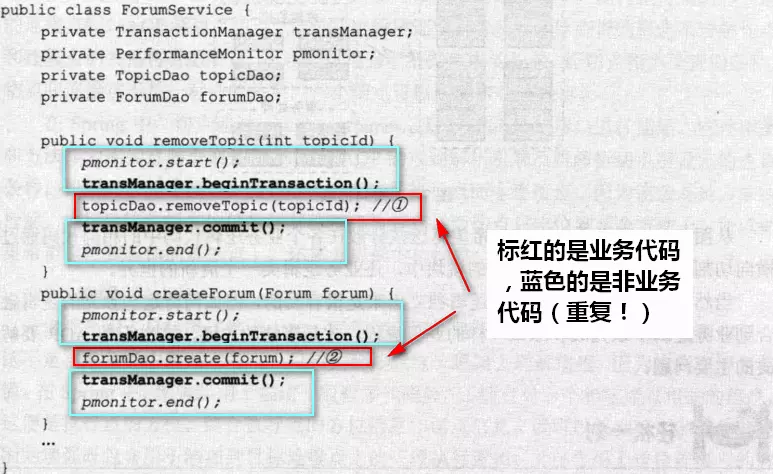
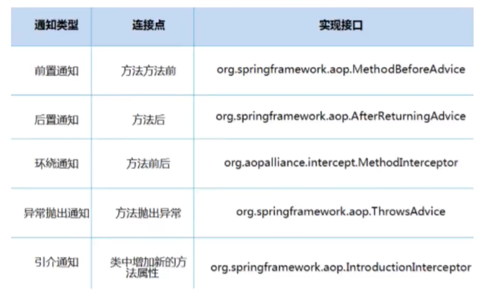
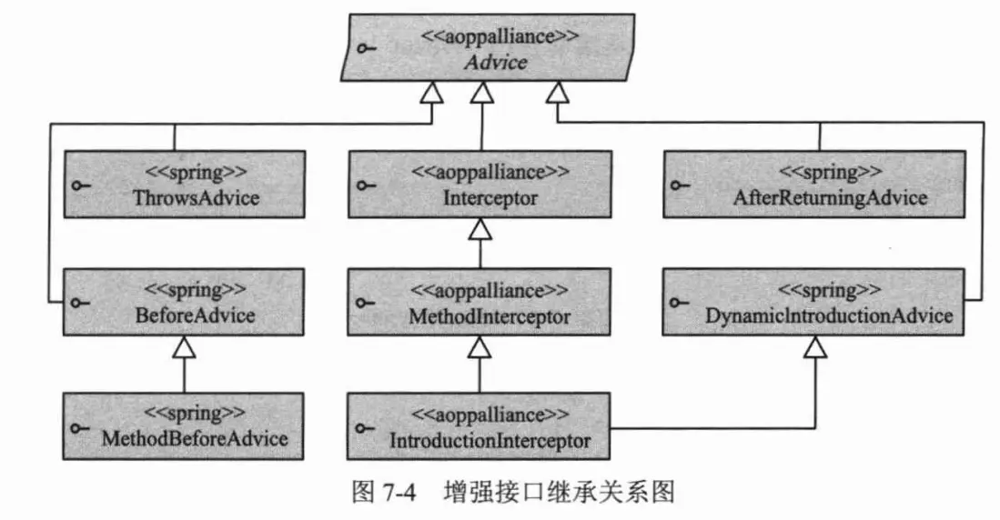
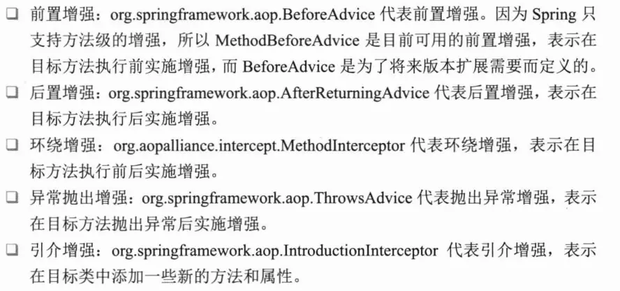
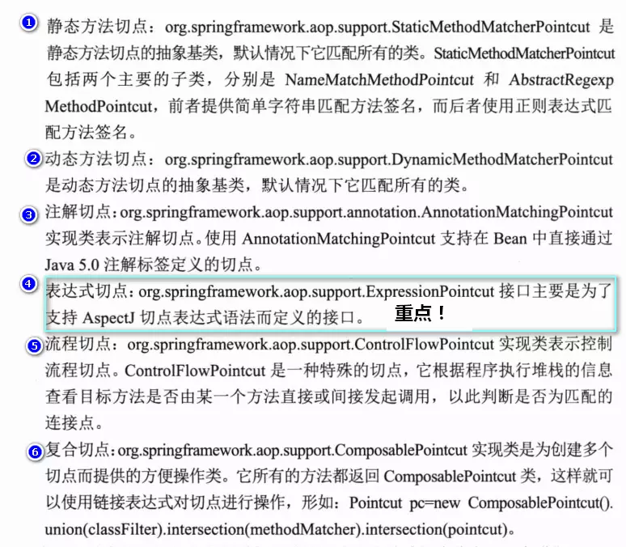
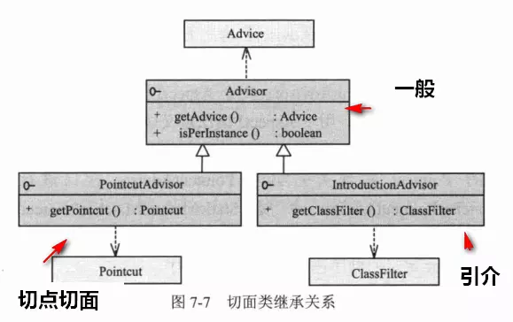

# Spring

## Spring简介

> 给软件行业带来了春天。
>
> 为了给降低企业级应用开发的复杂性而创建的。


**Spring如何简化开发**

+ 基于pojo的轻量级和最小入侵式编程
+ 通过IOC，依赖注入（DI）和面向接口实现松耦合
+ 基于切面AOP和惯例进行编程
+ 通过切面和模版减少代码


**优点**

+ spring是一个开源免费的框架（容器）
+ spring是一个轻量级的、非入侵式的框架
+ 控制反转（IOC）、面向切面编程（AOP)
+ 支持事务处理
+ 对框架的整合支持

> spring就是一个轻量级的控制反转（IOC）、面向切面编程的（AOP）的框架


## 什么是Spring？

所有的应用程序都是由一个个组件组成，每个组件负责自己在整体程序中的那部分功能，并与其它组件相互协调以完成工作。在程序运行时，需要创建这些组件并相互引用。

+ Spring的**核心**是一个**容器**，通常称之为Spring应用程序上下文，用于**创建和管理**应用**组件**。

+ 这些组件(Bean)在Spring上下文中连接在一起构成一个完整的应用程序。
+ 将Bean连接在一起的行为称为**依赖注入**(DI)。
+ 依赖项注入的应用程序不是由组件自身创建和维护他们依赖的其他Bean的生命周期，而依赖容器来创建和维护所有组件。
+ Spring容器将这些组件注入它们需要的Bean，通常使用构造函数参数或者属性访问器(set)来完成。


## Spring自动配置

Spring自动配置主要是由两部分构成:

+ 自动装配
    + 通过自动装配Spring会自动将组件与他们依赖的其他Bean一起注入。
+ 组件扫描
    + 借助组件扫描，Spring可以从路径中发现组件，并将其创建为Spring应用程序上下文中(就是把主键放入到容器里，等待其他Bean使用)。

**Spring Boot**

Spring Boot中最棒的功能就是`自动装配`，Spring Boot可以根据类路径中的条目、环境变量、其他因素，合理推断需要配置那些组件，并将他们连接在一起。


## Spring组成以及拓展



**现代Java开放就是基于Spring开发**


+ Spring Boot
    + 一个进行快速开发的脚手架。
    + 基于Spring Boot可以快速开发一个基于Spring的微服务。
    + 约定大于配置。
+ Spring Cloud
    + Spring Cloud是基于Spring Boot实现的。


**约定 > 配置 > 编码**


## IOC

> 在传统项目中，用户需求可能会影响到我们现有代码，我们需要根据用户的需求去更改现有源代码。如果程序代码量是否巨大，修改一次的成本非常昂贵。

**控制反转**

+ 创建对象的主动权不再是程序员，而交给调用者，程序员专注业务提供接口即可。
+ 获得依赖的对象的方式反转了，不在依赖程序员在代码中硬编码。


###  Spring实现IOC示例

> 实体类Hello

```java
package com.zhang.dao;

public class Hello {
    private String name;

    public Hello() {
    }

    public Hello(String name) {
        this.name = name;
    }

    public String getName() {
        return name;
    }

    public void setName(String name) {
        this.name = name;
    }

    @Override
    public String toString() {
        return "Hello{" +
                "name='" + name + '\'' +
                '}';
    }
}

```
> spring xml 配置文件 用于装载实体类，这样就可以通过id访问spring容器中的Hell实体类了

```xml
<?xml version="1.0" encoding="UTF-8"?>
<beans xmlns="http://www.springframework.org/schema/beans"
       xmlns:xsi="http://www.w3.org/2001/XMLSchema-instance"
       xsi:schemaLocation="http://www.springframework.org/schema/beans
        https://www.springframework.org/schema/beans/spring-beans.xsd">
    <!--id 相当于变量名、class相当于实体类-->
    <bean id="hello" class="com.zhang.dao.Hello">
        <!-- collaborators and configuration for this bean go here -->
    </bean>
</beans>
```

> 通过ClassPathXmlApplicationContext获取配置文件夹，从而生成ApplicationContext上下文对象

```java
public class MyTest {
    @Test
    public void helloTest() {
        ApplicationContext applicationContext = new ClassPathXmlApplicationContext("daos.xml");

        Hello hello = (Hello) applicationContext.getBean("hello");
        hello.setName("spring");
        System.out.println(hello.toString());
    }
}
```


### IOC创建对象的方式 (构造函数注入)

+ 使用无参构造函数创建

+ 使用有参构造函数创建

    + 下标赋值

        ```xml
        <bean id="beanUser" class="com.zhang.pojo.User">
            <!--通过索引对构造函数赋值-->
            <constructor-arg index="0" value="123"/>
        </bean>
        ```
        
    + 类型赋值

        ```xml
        <bean id="typeUser" class="com.zhang.pojo.User">
            <!--通过类型对构造函数赋值-->
            <constructor-arg type="java.lang.String" value="使用类型赋值"/>
        </bean>
        ```

    + 参数名赋值

        ```xml
        <bean id="nameUser" class="com.zhang.pojo.User">
            <!--通过变量名对构造函数赋值-->
            <constructor-arg name="name" value="通过变量名进行赋值"/>
        </bean>
        ```

> 在加载配置文件时，容器管理的对象就已经初始化了


## Spring配置

### 别名

```xml
<bean id="nameUser" class="com.zhang.pojo.User">
    <!--通过变量名对构造函数赋值-->
    <constructor-arg name="name" value="通过变量名进行赋值"/>
</bean>

<alias name="nameUser" alias="user"/>
```


### Bean的配置

```xml
<!--id: 是bean唯一标识符，相当于对象名-->
<!--class：bean 所对应的全限定名 = 包名+类型-->
<!--name：也是别名，可以起多个别名-->
<bean id="nameUser" class="com.zhang.pojo.User" name="u1, u2, u3">
    <!--通过变量名对构造函数赋值-->
    <constructor-arg name="name" value="通过变量名进行赋值"/>
</bean>
```


### Import

```xml
<!--导入其他的配置文件 合并在一起-->
<import resource="daos.xml"/>
<import resource="users.xml"/>
```


## 依赖注入

> 依赖：bean对象的创建依赖于Spring
>
> 注入：bean对象的所有属性，由Spring容器来注入装配。

### 构造器注入

```xml
<bean id="nameUser" class="com.zhang.pojo.User">
    <!--通过变量名对构造函数赋值-->
    <constructor-arg name="name" value="通过变量名进行赋值"/>
</bean>
```


### IOC创建对象的方式(Set方式注入★)

+ 依赖注入：set注入

    + 依赖：bean对象的创建依赖于容器
    + 注入：bean对象的所有属性，由容器来注入。


#### 注入的方式


```java
//pojo
package com.zhang.pojo;

import java.util.*;

public class Student {
    private String name;
    private Address address;
    private String[] books;
    private List<String> hobbys;
    private Map<String, String> card;
    private Set<String> games;
    private String wifi;
    private Properties info;

    //geter and seter

    @Override
    public String toString() {
        return "Student{" +
                "name='" + name + '\'' +
                ", address=" + address +
                ", books=" + Arrays.toString(books) +
                ", hobbys=" + hobbys +
                ", card=" + card +
                ", games=" + games +
                ", wifi='" + wifi + '\'' +
                ", info=" + info +
                '}';
    }
}

//===================================================================================================

package com.zhang.pojo;

public class Address
{
    private String address;

    public String getAddress() {
        return address;
    }

    public void setAddress(String address) {
        this.address = address;
    }

    @Override
    public String toString() {
        return "Address{" +
                "address='" + address + '\'' +
                '}';
    }
}

```

```xml
<?xml version="1.0" encoding="UTF-8"?>
<beans xmlns:xsi="http://www.w3.org/2001/XMLSchema-instance"
       xmlns="http://www.springframework.org/schema/beans"
       xsi:schemaLocation="http://www.springframework.org/schema/beans
                           https://www.springframework.org/schema/beans/spring-beans.xsd">
    <bean id="address" class="com.zhang.pojo.Address">
        <property name="address" value="上海"/>
    </bean>

    <bean id="student" class="com.zhang.pojo.Student">
        <!--普通方式给属性注入值-->
        <property name="name" value="小明" />
        <!--bean注入 通过ref-->
        <property name="address" ref="address"/>
        <!--数组注入-->
        <property name="books">
            <array>
                <value>三体</value>
                <value>朝闻道</value>
                <value>企业级开发SSM</value>
            </array>
        </property>
        <!--list注入-->
        <property name="hobbys">
            <list>
                <value>1</value>
                <value>2</value>
                <value>3</value>
                <value>4</value>
            </list>
        </property>
        <!--map-->
        <property name="card">
            <map>
                <entry key="id" value="2018338"/>
                <entry key="monery" value="2222"/>
            </map>
        </property>
        <!--set-->
        <property name="games">
            <set>
                <value>WOW</value>
                <value>LOL</value>
                <value>OW</value>
            </set>
        </property>
        <property name="wifi">
            <null/>
        </property>
        <property name="info">
            <props>
                <prop key="year">19</prop>
                <prop key="age">20</prop>
                <prop key="num">100</prop>
            </props>
        </property>
    </bean>
</beans>
```


### 拓展方式

> 可以使用**P**命名空间和**C**命名空间进行注入。
>
> **注意** ：他们不可以直接使用需要导入xml约束。
>
> + xmlns:p="http://www.springframework.org/schema/p"
> + xmlns:c="http://www.springframework.org/schema/c"


#### p命名空间

```xml
<?xml version="1.0" encoding="UTF-8"?>
<beans xmlns="http://www.springframework.org/schema/beans"
       xmlns:xsi="http://www.w3.org/2001/XMLSchema-instance"
       xmlns:c="http://www.springframework.org/schema/c"
       xmlns:p="http://www.springframework.org/schema/p"
       xsi:schemaLocation="http://www.springframework.org/schema/beans
        https://www.springframework.org/schema/beans/spring-beans.xsd">

    <!--p-namespace p命名空间方式，可以直接注入属性值: property 通过set方式-->
    <bean id="user1" class="com.zhang.pojo.User" p:age="18" p:name="小明" />
</beans>
```


#### c命名空间

```xml
<?xml version="1.0" encoding="UTF-8"?>
<beans xmlns="http://www.springframework.org/schema/beans"
       xmlns:xsi="http://www.w3.org/2001/XMLSchema-instance"
       xmlns:c="http://www.springframework.org/schema/c"
       xmlns:p="http://www.springframework.org/schema/p"
       xsi:schemaLocation="http://www.springframework.org/schema/beans
        https://www.springframework.org/schema/beans/spring-beans.xsd">
    
    <!--c-namespace c命名空间，可以通过构造器注入：construct-args-->
    <bean id="user2" class="com.zhang.pojo.User" c:age="16" c:name="小李" />
</beans>
```


## Bean作用域 Bean Scopes




### 单例模式 singleton (默认)

```xml
<bean id="user2" class="com.zhang.pojo.User" c:age="16" c:name="小李" scope="singleton" />
```


### 原型模式 

> 每次从spring容器中getbean的时候都会参数一个新的对象

```xml
<bean id="user2" class="com.zhang.pojo.User" c:age="16" c:name="小李" scope="prototype" />
```


### Web模式中使用

#### [request](https://docs.spring.io/spring/docs/5.2.4.RELEASE/spring-framework-reference/core.html#beans-factory-scopes-request)


#### [session](https://docs.spring.io/spring/docs/5.2.4.RELEASE/spring-framework-reference/core.html#beans-factory-scopes-session)


#### [application](https://docs.spring.io/spring/docs/5.2.4.RELEASE/spring-framework-reference/core.html#beans-factory-scopes-application)


## Bean自动装配

### 装配

> 创建对象的协作关系称为装配，也就是DI（依赖注入）的本质。

> 自动装配是Spring满足Bean依赖得一种方式。
>
> Spring会在上下文中自动寻找并给Bean装配属性。

### Spring三种装配模式

+ 在xml中显式的配置
    + 通过property -- set方式
    + 通过constructor-arg -- 构造函数

+ 在Java中显式的配置

+ **隐式的bean扫描发现机制和自动装配★**

#### byName自动装配

```xml
<?xml version="1.0" encoding="UTF-8"?>
<beans xmlns:xsi="http://www.w3.org/2001/XMLSchema-instance"
       xmlns="http://www.springframework.org/schema/beans"
       xsi:schemaLocation="http://www.springframework.org/schema/beans
        https://www.springframework.org/schema/beans/spring-beans.xsd">
    <bean id="dog" class="com.zhang.pojo.Dog"/>
    <bean id="cat" class="com.zhang.pojo.Cat"/>

    <!--byName 会通过Spring容器上下文中查找和自己Set方法后面值对应的Bean ID-->
    <!--setDog > dog-->
    <!--setCat > catW-->
    <bean id="human" class="com.zhang.pojo.Human" autowire="byName">
        <property name="name" value="小张"/>
    </bean>
</beans>
```
> **注意** ：byName在使用时需要保证所以bean id唯一，且这个bean的id需要和自动注入属性的set方法得值一样。

#### byType自动装配

```xml
<?xml version="1.0" encoding="UTF-8"?>
<beans xmlns:xsi="http://www.w3.org/2001/XMLSchema-instance"
       xmlns="http://www.springframework.org/schema/beans"
       xsi:schemaLocation="http://www.springframework.org/schema/beans
        https://www.springframework.org/schema/beans/spring-beans.xsd">
    <bean id="dog1" class="com.zhang.pojo.Dog"/>
    <bean id="cat1" class="com.zhang.pojo.Cat"/>

    <!--byName 会通过Spring容器上下文中查找和自己对象属性相同类型Bean ID-->
    <bean id="human" class="com.zhang.pojo.Human" autowire="byType">
        <property name="name" value="小张"/>
    </bean>
</beans>
```
>**注意** ：byName在使用时需要保证所以bean class类型唯一，且这个bean需要和自动注入对象属性的类型一致。


#### 使用注解实现自动装配

##### 使用注解的支持步骤

+ 导入xml约束

+ **配置注解的支持 `<context:annotation-config/>`**

    ```xml
    <?xml version="1.0" encoding="UTF-8"?>
    <beans xmlns="http://www.springframework.org/schema/beans"
        xmlns:xsi="http://www.w3.org/2001/XMLSchema-instance"
        xmlns:context="http://www.springframework.org/schema/context"
        xsi:schemaLocation="http://www.springframework.org/schema/beans
            https://www.springframework.org/schema/beans/spring-beans.xsd
            http://www.springframework.org/schema/context
            https://www.springframework.org/schema/context/spring-context.xsd">
    
        <context:annotation-config/>
        <!--扫描package下的@Component , @Controller , @Service , @Repository注解装配bean 此方法拥有<context:annotation-config/>的全部方法-->
        <context:component-scan base-package="com.zhang"/>
</beans>
    ```
    
    

##### @Autowired

**默认通过byType方式实现**


自动寻找bean方式：

按类型 > 按set后面的值和xml配置id > @Qualifirer(value="显示的设置与xml中bean id 一样的值")

```java

public class Human {
    private String name;
    @Autowired //优先寻找byType > 类型重复byName > idea报错
    private Cat cat;
    @Autowired
    @Qualifier(value="dog1") //指定bean配置id
    private Dog dog;

    //geter and seter

    @Override
    public String toString() {
        return "Human{" +
                "name='" + name + '\'' +
                ", cat=" + cat +
                ", dog=" + dog +
                '}';
    }
}
```


```xml
<?xml version="1.0" encoding="UTF-8"?>
<beans xmlns:xsi="http://www.w3.org/2001/XMLSchema-instance"
       xmlns:context="http://www.springframework.org/schema/context"
       xmlns="http://www.springframework.org/schema/beans"
       xsi:schemaLocation="http://www.springframework.org/schema/beans
        https://www.springframework.org/schema/beans/spring-beans.xsd
        http://www.springframework.org/schema/context
        https://www.springframework.org/schema/context/spring-context.xsd">
    <context:annotation-config/>

    <bean id="cat2" class="com.zhang.pojo.Cat"/>
    <bean id="cat" class="com.zhang.pojo.Cat"/>
    <bean id="dog" class="com.zhang.pojo.Dog"/>
    <bean id="dog1" class="com.zhang.pojo.Dog"/>
    <bean id="human" class="com.zhang.pojo.Human"/>
</beans>
```


##### @Resource

```java

public class Human {
    private String name;
    @Resource //优先寻找byName > 找不到byType > 运行报错
    private Cat cat;
    @Resource(name = "dog1") //指定装配id
    private Dog dog;

    //geter and seter

    @Override
    public String toString() {
        return "Human{" +
                "name='" + name + '\'' +
                ", cat=" + cat +
                ", dog=" + dog +
                '}';
    }
}

```

```xml
<?xml version="1.0" encoding="UTF-8"?>
<beans xmlns:xsi="http://www.w3.org/2001/XMLSchema-instance"
       xmlns:context="http://www.springframework.org/schema/context"
       xmlns="http://www.springframework.org/schema/beans"
       xsi:schemaLocation="http://www.springframework.org/schema/beans
        https://www.springframework.org/schema/beans/spring-beans.xsd
        http://www.springframework.org/schema/context
        https://www.springframework.org/schema/context/spring-context.xsd">
    <context:annotation-config/>

    <bean id="cat2" class="com.zhang.pojo.Cat"/>
    <bean id="cat" class="com.zhang.pojo.Cat"/>
    <bean id="dog" class="com.zhang.pojo.Dog"/>
    <bean id="dog1" class="com.zhang.pojo.Dog"/>
    <bean id="human" class="com.zhang.pojo.Human"/>
</beans>
```

**总结:**

> AutoWired和Resource的区别：
>
> + 相同：
>     + 都是用来实现自动装配的，都可以放在属性字段上
> + 不同：
>     + Autowired是通过默认通过**byType**实现，而且这个对象必须存在
>     + Resource是通过**byName**实习的，如果找不到名字，则通过byType实现，如果两种都找不到就报错


##### @Nullable

> 如果字段标记这个注解，说明这个字段可以为null


## 使用注解开发

> + 在spring4之后，要用注解开发，必须保证aop的包被导入
> + 需要在xml配置中导入context约束，来增加注解的支持


### @Autowired > 属性

> 自动通过类型别名装配


### @Qualifirer > 属性

> Qualifirer(value="设置别名")


### @Nullable > 属性

> 允许这个字段为null


### @Resource > 属性

> 与autowired功能类似，区别在于优先使用byName，其次是byType


### @Componet > 类

> 这个注解放到类上，说明这个类被Spring管理了，相当于手动装配bean。

```xml
<bean id="cat" class="com.zhang.pojo.Cat"/> // 等价于
```

##### 衍生注解

在web开发中，会按照mvc架构分层

+ dao
    + @Repository
+ service
    + @Service
+ controller
    + @Controller

> 四个注解意思都是一样的，都是将类注册的Spring容器中，装配Bean。
>
> 不过要记得在Spring配置中扫描包文件。


### @Value > 属性

```xml
//等价于 为属性赋值
<bean id="human" class="com.zhang.pojo.Human" >
    <property name="name" value="小张"/>
</bean>
```


### @Scope > 类

作用域：

+ 单例模式 @Scope("singleton")
+ 原型模式@Scope("prototype")


### @Configuration

注释向 Spring 表明这是一个配置类，它将为 Spring 应用程序上下文提供 beans。配置的类方法带有 `@Bean` 注释

通常@Bean的ID与方法名相同。

xml方式：

```xml
<bean id="inventoryService" class="com.example.InventoryService" />
<bean id="productService" class="com.example.ProductService" >
    <constructor-arg ref="inventoryService" />
</bean>
```

java方式：

```java
@Configuration
public class ServiceConfiguration {
    @Bean
    public InventoryService inventoryService() {
        return new InventoryService();
    }
    
    @Bean
    public ProductService productService() {
        return new ProductService(inventoryService());
    }
}
```


### @ComponentScan

> @ComponentScan("com.zhang") 通过包扫描的方式装配Bean，bean默认id 首字母小写


> xml与注解小结：
>
> + xml更加万能，相对于注解适用于任何场合。维护简单。
> + 注解不是自己的类用不了，维护相对复杂。
>
> xml与注解最佳实践：
>
> + xml用于管理bean
> + 注解用来负责注入属性


## 使用Java配置Spring

```java
//config
@Configuration
//@ComponentScan("com.zhang")
public class beanConfig {
    @Bean
    public UserService getUserService() {
        return new UserService();
    }
}

//service
@Service("service")
public class UserService {
    public void getUserService(boolean b) {
        UserController userController = new UserController();
        userController.getUserData(b);
    }
}

//Test
@Test
public void getUserDataAnnotationForJava() {
    ApplicationContext context = new AnnotationConfigApplicationContext(beanConfig.class);
    //通过方法名调用
    UserService userService = (UserService) context.getBean("getUserService");
    //通过指定id调用 id 未指定则通过类名首字母小写调用 userService
    //UserService userService = (UserService) context.getBean("service");
    userService.getUserService(true);
}
```


## AOP


### AOP概述

> AOP：面向切面编程
>
> 通过预编译的方式和运行期间动态代理实现程序功能的同意的一种技术。AOP是OOP的延续，是软件开发的一个热点，也是Spring框架中的重要内容，是函数式编程的一种衍生泛型。利用AOP可以对业务逻辑和各个部分进行隔离，从而是的业务各个部分之间的耦合度降低，提高程序可用性，同时提高开发效率。
>
> 
>
> 即AOP在不改变原有代码的情况下，去增加新的功能。




### 概念图


### AOP术语

- 横切关注点
  
    - 跨越应用程序多个模块的方法或功能。即是，与我们业务逻辑无关的，但是我们需要关注的部分，就是横切关注点，如日志、安全、缓存、事务等等……
- 切面（ASPECT）
    - 泛指交叉的业务逻辑。比如日志类。
    - 横切关注点被模块化的特殊对象，即是一个类。
- 织入（Weaving）
    - 指将切面插入到目标对象的一个过程。
    - 动态代理中，invoke()方法完成的工作就可以称为织入。
- 连接点（JoinPoint）
    - 指切面可以织入的位置。
    - 连接点是一个虚拟的概念，可以说所有满足扫描条件的都可以称为连接点，一般是业务逻辑中的方法。
- 切入点（PointCut）
    - 指切面具体织入的位置。
    - 比如，为dao层的所有方法增强功能，添加日志记录。dao层每个方法都是一个切入点。
- 通知（Advice）
    - 通知是切面的一种实现，在spring中可以完成简单的织入功能。
    - 通知分类：
        - 前置通知MethodBeforeAdvice
        - 后置通知AfterReturningAdvice
        - 环绕通知MethodInterceptor
        - 异常通知ThrowsAdvice
         		
- 目标对象（Target）
  
    - 将要被织入增强的对象。
- 代理对象（Proxy）
    - 向目标对象应用通知之后创建的对象。
    - 代理对象 = 目标对象 + 交叉业务逻辑(切面织入的代码，日志等)


### 依赖环境

**需要导入依赖包** 织入包

```xml
<dependency>
    <groupId>org.aspectj</groupId>
    <artifactId>aspectjweaver</artifactId>
    <version>1.6.8.RELEASE</version>
</dependency>
```


### Spring实现AOP的三种方式


#### 方式一 基于代理的经典SpringAOP 基于接口实现


强接口的继承关系图：




可以分成**五类**增强的方式：




Spring提供了**六种的切点类型**：




**切面类型主要分成了三种**：

- **一般切面**

- **切点切面**

- **引介/引入切面**

    


**需要实现接口，手动创建代理**

```java
// User类
public class User {
    public String name;
    public int age;

    public User() {
    }

    public User(String name, int age) {
        this.name = name;
        this.age = age;
    }

    //geter and serter

    @Override
    public String toString() {
        return "User{" +
            "name='" + name + '\'' +
            ", age=" + age +
            '}';
    }
}

// user类dao接口
public interface UserDaoI {
    List<User> selectAllUser();

    void deleteUser(int id);

    void updateUser(User u);

    void insertUser(User u);
}
// user类dao层实现类
public class UserDao implements UserDaoI {
    public List<User> selectAllUser() {
        System.out.println("输出用户");
        return null;
    }

    public void deleteUser(int id) {
        System.out.println("删除用户");
    }

    public void updateUser(User u) {
        System.out.println("更新用户");
    }

    public void insertUser(User u) {
        System.out.println("新增用户");
    }
}
// 后置通知 后置log
public class AfterLog implements AfterReturningAdvice {
    public void afterReturning(Object o, Method method, Object[] objects, Object o1) throws Throwable {
        System.out.println("after:" + method.getName());
    }
}
// 前置通知 前置log
public class BeforeLog implements MethodBeforeAdvice {
    public void before(Method method, Object[] objects, Object o) throws Throwable {
        System.out.println("before:" + method.getName() + "   " + objects);
    }
}
//text
public class MyTest {
    @Test
    public void AopTest() {
        ApplicationContext context = new ClassPathXmlApplicationContext("applictionContext.xml");
        //User user = (User) context.getBean("user");
        //user.toString();
        UserDaoI userDaoI = context.getBean("userDao", UserDaoI.class);
        userDaoI.selectAllUser();
    }
}
```

```xml
<?xml version="1.0" encoding="UTF-8"?>
<beans xmlns:xsi="http://www.w3.org/2001/XMLSchema-instance"
       xmlns:aop="http://www.springframework.org/schema/aop"
       xmlns="http://www.springframework.org/schema/beans"
       xsi:schemaLocation="http://www.springframework.org/schema/beans
        https://www.springframework.org/schema/beans/spring-beans.xsd
        http://www.springframework.org/schema/aop
        https://www.springframework.org/schema/aop/spring-aop.xsd">

    <!--注册bean-->
    <bean id="user" class="com.zhang.pojo.User"/>
    <bean id="userDao" class="com.zhang.dao.UserDao"/>
    <bean id="afterLog" class="com.zhang.log.AfterLog"/>
    <bean id="beforeLog" class="com.zhang.log.BeforeLog"/>

    <!--配置aopconfig-->
    <aop:config>
        <!--切入点-->
        <aop:pointcut id="pointcutt" expression="execution(* com.zhang.dao.UserDao.*(..))"/>
        <!--执行环绕增加-->
        <aop:advisor advice-ref="afterLog" pointcut-ref="pointcutt"/>
        <aop:advisor advice-ref="beforeLog" pointcut-ref="pointcutt"/>
    </aop:config>
</beans>
```


#### 方式二  纯POJO切面 通过自定义类来实现AOP

**使用XML配置，aop命名空间**

```java
// 自定义切面
public class DiyAdvice {
    public void beforeAdvice() {
        System.out.println("========before==========");
    }

    public void afterAdvice() {
        System.out.println("========after==========");
    }
}
```


```xml
<?xml version="1.0" encoding="UTF-8"?>
<beans xmlns:xsi="http://www.w3.org/2001/XMLSchema-instance"
       xmlns:aop="http://www.springframework.org/schema/aop"
       xmlns="http://www.springframework.org/schema/beans"
       xsi:schemaLocation="http://www.springframework.org/schema/beans
        https://www.springframework.org/schema/beans/spring-beans.xsd
        http://www.springframework.org/schema/aop
        https://www.springframework.org/schema/aop/spring-aop.xsd">

    <!--注册bean-->
    <bean id="user" class="com.zhang.pojo.User"/>
    <bean id="userDao" class="com.zhang.dao.UserDao"/>
    <bean id="afterLog" class="com.zhang.log.AfterLog"/>
    <bean id="beforeLog" class="com.zhang.log.BeforeLog"/>
    
    <!--方式二 通过自定义类实现-->
    <bean id="diyAdvice" class="com.zhang.diy.DiyAdvice" />
    <aop:config>
        <!--自定义切面-->
        <aop:aspect ref="diyAdvice">
            <!--切入点-->
            <aop:pointcut id="point" expression="execution(* com.zhang.dao.UserDao.*(..))"/>
            <!--通知-->
            <aop:after method="afterAdvice" pointcut-ref="point" />
            <aop:before method="beforeAdvice" pointcut-ref="point" />
        </aop:aspect>
    </aop:config>
</beans>
```


#### 方式三 `@Aspect`注解驱动的切面

**使用注解的方式，这是最简洁和最方便的！**

1. 在Spring配置文件中开启注解支持

    ```xml
    <!--开启注解支持AOP-->
    <aop:aspectj-autoproxy/>
    ```

2. 定义一个切面

    ```java
    @Component
    @Aspect //用来注解此类是个切面
    public class Logs {
        
    }
    ```

3. 定义相关的通知

    ```java
    
    @Component
    @Aspect
    public class Logs {
        @Before
        public void BeforeAdvice() {
            System.out.println("==========日志前==========");
        }
    
        @After
        public void AfterAdvice() {
            System.out.println("==========日志后==========");
        }
    }
    ```

4. 通过execution创建切入点

    ```java
    @Component
    @Aspect
    public class Logs {
        @Before("execution(* com.zhang.dao.UserMapperImpl.*(..))")
        public void BeforeAdvice() {
            System.out.println("==========日志前==========");
        }
    
        @After("execution(* com.zhang.dao.UserMapperImpl.*(..))")
        public void AfterAdvice() {
            System.out.println("==========日志后==========");
        }
    }
    ```

5. 测试


## 声明式事务

事务的原则：

+ 原子性
+ 一致性
+ 隔离性
+ 持久性


### Spring中的事务管理

+ 声明式事务

    + AOP方式 --- 交由Spring容器进行管理事务

    + 配置：

        ```xml
        <!--配置声明事务-->
        <bean id="transactionManager" class="org.springframework.jdbc.datasource.DataSourceTransactionManager">
            <constructor-arg ref="dataSource"/>
        </bean>
        <!--结合AOP实现事务织入-->
        <!--配置事务通知-->
        <tx:advice id="txAdvice" transaction-manager="transactionManager">
            <!--给那些方法配置事务-->
            <!--配置事务的传播特性-->
            <tx:attributes>
                <tx:method name="select" propagation="REQUIRED" read-only="true"/>
                <tx:method name="delete"/>
                <tx:method name="*"/>
            </tx:attributes>
        </tx:advice>
        <!--配置事务的切入点-->
        <aop:config>
            <!--切入点-->
            <aop:pointcut id="txPointcut" expression="execution(* com.zhang.dao.*.*(..))"/>
            <!--切入-->
            <aop:advisor advice-ref="txAdvice" pointcut-ref="txPointcut"/>
        </aop:config>
        ```

+ 编程式事务
  
    + 需要在代码中，进行事务管理
    + 需要硬编码 不推荐


**思考：为什么要使用事务？**

+ 如果不配置不使用事务，可能会存在数据提交不一致的问题。
+ 如果不在Spring中配置声明式事务，就需要在代码中硬编码手动配置事务！
+ 事务在项目开发中非常重要，涉及到数据的一致性和完整性，不可马虎。