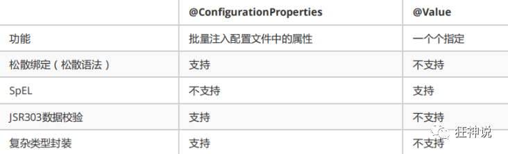
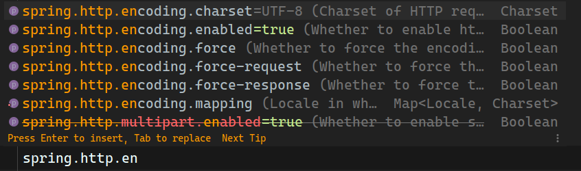
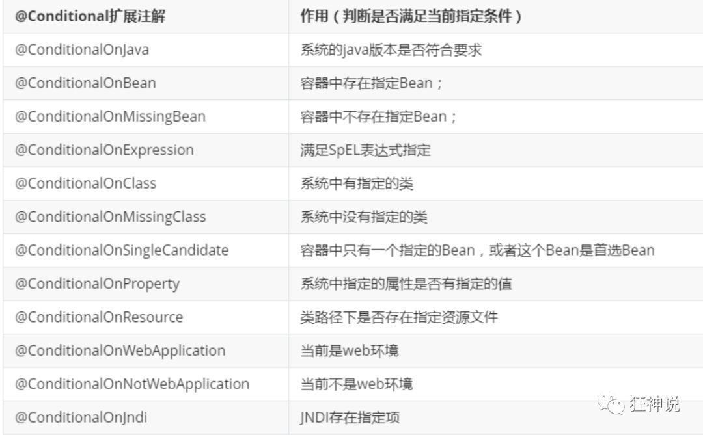
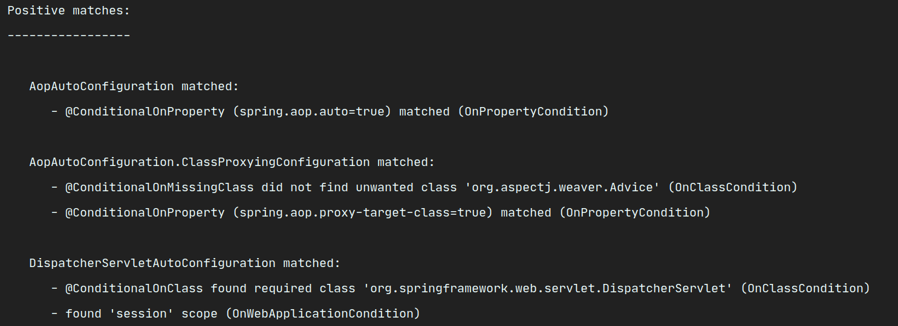
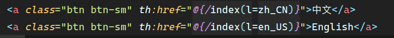
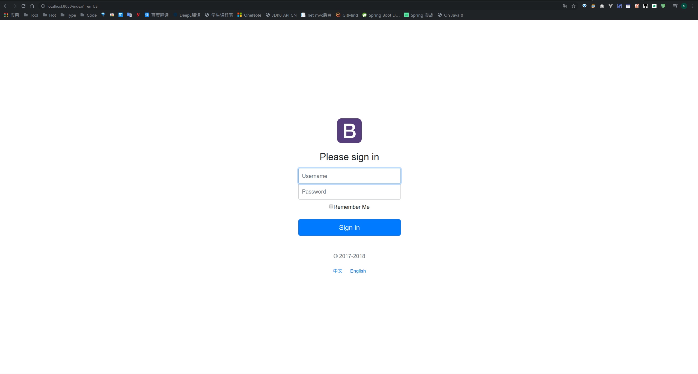

# 概述

> Spring Boot 将我们从配置文件中解放了出来，Spring Boot 提供了大量的默认配置，我们只需要少数的配置甚至不配置，就可以建立起来一个 Spring Boot 应用，简直就是 Java 程序员的福音。

> SpringBoot以Spring Framework的进步为基础，实现了自动配置，这让Spring能够智能探测正在构建何种应用程序，自动配置必要的组件以满足应用程序的需要。对于那些常见的配置场景，不再需要显式地编写配置了，Spring会替你料理好一切。

#### Spring Boot 的优点

- 使用 Spring Initializr 可以在几秒钟就配置好一个 Spring Boot 应用。
- 对大量的框架都可以无缝集成，基本不需要配置或者很少的配置就可以运行。
- 简化的安全性。
- 丰富的 SQL 和 NoSQL 支持。
- 嵌入式 Servlet 容器的支持。如：Tomcat，Jetty 和 Undertow。
- 提高开发、生产效率，如热部署等功能。
- 提供监控功能，如跟踪，指标和健康状况。


# 原理初探

## 前言

> Spring Boot通过默认配置，帮我们大幅简化项目厨师搭建以及开发的过程。

SpringBoot帮我们做了什么？

通常搭建一个基于spring的web应用，我们需要做以下工作：

1. pom文件中引入相关jar包，包括spring、springmvc、redis、mybaits、log4j、mysql-connector-java 等等相关jar ...

2. 配置web.xml，Listener配置、Filter配置、Servlet配置、log4j配置、error配置 ...

3. 配置数据库连接、配置spring事务

4. 配置视图解析器

5. 开启注解、自动扫描功能

6. 配置完成后部署tomcat、启动调试
7. ......


总结：

​			搭建一个初始项目耗时长，配置繁琐，还有很多重复内容。而用SpringBoot后，一切都变得很简便快速。下来我们来一步步分析SpringBoot的起步`依赖`与`自动配置`这两个核心原理。


## 依赖文件

> 通过idea集成的spring init工具我们可以很轻易的搭建spring boot项目。选择web项目后会自动生成web项目所需要的依赖配置。

### pom.xml核心依赖文件

+ spring-boot-dependencies 核心依赖在父工程中。（包含springboot的精选jar版本、资源过滤配置）因为导入精选jar列表的存在，所以导入jar不需要指定版本。


### 启动器

> springboot将所有的功能变成一个个starter启动器。如果需要某个功能，在dependencies中导入spring-boot-starter-*依赖即可。

[starter](https://docs.spring.io/spring-boot/docs/2.2.6.RELEASE/reference/htmlsingle/#using-boot-starter)列表大全

pow.xml文件下的依赖

```xml
<dependencies>
        <!--spring web支持-->
        <dependency>
            <groupId>org.springframework.boot</groupId>
            <artifactId>spring-boot-starter-web</artifactId>
        </dependency>
        <!--spring test支持-->
        <dependency>
            <groupId>org.springframework.boot</groupId>
            <artifactId>spring-boot-starter-test</artifactId>
            <scope>test</scope>
            <exclusions>
                <exclusion>
                    <groupId>org.junit.vintage</groupId>
                    <artifactId>junit-vintage-engine</artifactId>
                </exclusion>
            </exclusions>
        </dependency>
    </dependencies>
```

+ spring-boot-starter 核心启动器、包括导入依赖的jar、自定义的jar包配置。
+ spring-boot-starter-web 会帮助我们自动引入web环境所需要的依赖。

+ spring-boot-starter-test 会帮助我们自动引入test模块所需要的包文件。

+ spring-boot-starter-* 是官方提供的起启动器，通常它包含所这个功能需要的所有jar依赖。

+ *-spring-boot-starter 是第三方提供的starter。


### 打包插件

> 用来将springboot项目打包成一个完整jar包文件。

```xml
<build>
    <plugins>
        <plugin>
            <groupId>org.springframework.boot</groupId>
            <artifactId>spring-boot-maven-plugin</artifactId>
        </plugin>
    </plugins>
</build>
```


使用方法：

```shell
mvn package
```


## 主程程序(启动入口类)

### 概述

**代码：**

```java
// 开启组件扫描和自动配置
@SpringBootApplication
public class SpringBoot02ConfigApplication {
    public static void main(String[] args) {
        // 负责启动引导程序
        SpringApplication.run(SpringBoot02ConfigApplication.class, args);
    }
}

```

+ 当SpringBoot应用启动时就会从这里的主方法启动。
+ @SpringBootApplication中最重要的注解就是SpringBoot开启了一个@EnableAutoConfiguration的注解从而实现自动配置的功能。


### 注解

+ @*SpringBootApplication* 标注这个类是一个springboot应用，通过反射让后委托完成功能实现。
  + @*SpringBootConfiguration*  springboot配置注解
    + @*Configuration* 标注此类是一个spring的配置类
      + @*Component* 标注此类是一个spring的组件，将pojo实例化到spring容器中。
  + @*EnableAutoConfiguration* 自动配置
    + @*AutoConfigurationPackage* **添加该注解的类所在的package** 作为 **自动配置package** 进行管理
      
      + @Import(AutoConfigurationPackages.Registrar.class) 自动配置包注册
    + @*Import(AutoConfigurationImportSelector.class)*   自动配置导入选择器
      
      + List<String> configurations = getCandidateConfigurations(annotationMetadata, attributes); 获取所有配置
      
      

#### @SpringBootApplication

> @SpringBootApplication是SpringBoot核心注解，标注这个类是一个SpringBoot应用，目的是为了开启自动配置。

**结构如下**：

##### @SpringBootConfiguration

> 用来标注这是一个SpringBoot的配置类。

###### @Configuration

> 用于定义配置类，可替换xml配置文件，被注解的类内部包含有一个或多个被@Bean注解的方法，这些方法将会被AnnotationConfigApplicationContext或AnnotationConfigWebApplicationContext类进行扫描，并用于构建bean定义，初始化Spring容器。

@Component

> 标注这是一个Spring组件，此类会被加载到SpringIOC容器中。


##### @EnableAutoConfiguration

> 开启自动配置的功能。
>
> @EnableAutoConfiguration告诉SpringBoot开启自动配置功能，这样自动配置才能生效；

*在使用Spring的时候，配置文件都需要自己添加配置，而现在SpringBoot自动帮我们实现自动配置的功能。*


###### @AutoConfigurationPackage

> 作用是将添加该注解的类所在的packeage作为自动配置package进行管理。

```java
@Import(AutoConfigurationPackages.Registrar.class)
public @interface AutoConfigurationPackage {

}
```

+ @`Import` Spring底层注解Import，用来给容器导入一个组件


###### @Import(AutoConfigurationImportSelector.class)

给容器导入`AutoConfigurationImportSelector`组件

`***AutoConfigurationImportSelector***` 自动配置导入选择器，推断所需要的自动配置。

1. selectImports()方法在内部调用`getAutoConfigurationEntry`()方法

   ```java
   @Override
   	public String[] selectImports(AnnotationMetadata annotationMetadata) {
   		if (!isEnabled(annotationMetadata)) {
   			return NO_IMPORTS;
   		}
   		AutoConfigurationMetadata autoConfigurationMetadata = AutoConfigurationMetadataLoader
   				.loadMetadata(this.beanClassLoader);
   		AutoConfigurationEntry autoConfigurationEntry = getAutoConfigurationEntry(autoConfigurationMetadata,
   				annotationMetadata);
   		return StringUtils.toStringArray(autoConfigurationEntry.getConfigurations());
   	}
   ```

2. getAutoConfigurationEntry()

   > 可以看到在名为`configurations`的List中，包含了各种以AutoConfiguration结尾的自动配置类，configurations都是从`getCandidateConfigurations`()方法获取的。

   ```java
   protected AutoConfigurationEntry getAutoConfigurationEntry(AutoConfigurationMetadata autoConfigurationMetadata,
   			AnnotationMetadata annotationMetadata) {
   		if (!isEnabled(annotationMetadata)) {
   			return EMPTY_ENTRY;
   		}
   		AnnotationAttributes attributes = getAttributes(annotationMetadata);
   		List<String> configurations = getCandidateConfigurations(annotationMetadata, attributes);
   		configurations = removeDuplicates(configurations);
   		Set<String> exclusions = getExclusions(annotationMetadata, attributes);
   		checkExcludedClasses(configurations, exclusions);
   		configurations.removeAll(exclusions);
   		configurations = filter(configurations, autoConfigurationMetadata);
   		fireAutoConfigurationImportEvents(configurations, exclusions);
   		return new AutoConfigurationEntry(configurations, exclusions);
   	}
   ```

3. getCandidateConfigurations()方法

   可以发现这个`configurations`主要是由`SpringFactoriesLoader.loadFactoryNames`这个方法获取的

   它包含两个参数：

   + `getSpringFactoriesLoaderFactoryClass`()方法，是获取`EnableAutoConfiguration`这个注解
   + `getBeanClassLoader`()方法们获取该类的Bean加载器。

   ```java
   protected List<String> getCandidateConfigurations(AnnotationMetadata metadata, AnnotationAttributes attributes) {
       List<String> configurations = SpringFactoriesLoader.loadFactoryNames(getSpringFactoriesLoaderFactoryClass(),
                                                                            getBeanClassLoader());
       Assert.notEmpty(configurations, "No auto configuration classes found in META-INF/spring.factories. If you "
                       + "are using a custom packaging, make sure that file is correct.");
       return configurations;
   }
   ```

   查看`loadFactoryNames`()方法

   ```java
   public static List<String> loadFactoryNames(Class<?> factoryType, @Nullable ClassLoader classLoader) {
       String factoryTypeName = factoryType.getName();
       return loadSpringFactories(classLoader).getOrDefault(factoryTypeName, Collections.emptyList());
   }
   ```

   再查看`loadSpringFactories`()方法

   ```java
   private static Map<String, List<String>> loadSpringFactories(@Nullable ClassLoader classLoader) {
       MultiValueMap<String, String> result = cache.get(classLoader);
       if (result != null) {
           return result;
       }
   
       try {
           Enumeration<URL> urls = (classLoader != null ?
                                    classLoader.getResources(FACTORIES_RESOURCE_LOCATION) :
                                    ClassLoader.getSystemResources(FACTORIES_RESOURCE_LOCATION));
           result = new LinkedMultiValueMap<>();
           while (urls.hasMoreElements()) {
               URL url = urls.nextElement();
               UrlResource resource = new UrlResource(url);
               Properties properties = PropertiesLoaderUtils.loadProperties(resource);
               for (Map.Entry<?, ?> entry : properties.entrySet()) {
                   String factoryTypeName = ((String) entry.getKey()).trim();
                   for (String factoryImplementationName : StringUtils.commaDelimitedListToStringArray((String) entry.getValue())) {
                       result.add(factoryTypeName, factoryImplementationName.trim());
                   }
               }
           }
           cache.put(classLoader, result);
           return result;
       }
       catch (IOException ex) {
           throw new IllegalArgumentException("Unable to load factories from location [" +
                                              FACTORIES_RESOURCE_LOCATION + "]", ex);
       }
   }
   ```

   这个类下包含一个`常量` `META-INF/spring.factories`

   ```java
   public static final String FACTORIES_RESOURCE_LOCATION = "META-INF/spring.factories";
   ```

   类加载器先会尝试查找路径为`META-INF/spring.factories`的资源。

4. `spring.factories`记录了大量的配置类

   > 文件在`org.springframework.boot.autoconfigure`jar下面

   

   ```properties
   # Initializers
   org.springframework.context.ApplicationContextInitializer=\
   org.springframework.boot.autoconfigure.SharedMetadataReaderFactoryContextInitializer,\
   org.springframework.boot.autoconfigure.logging.ConditionEvaluationReportLoggingListener
   
   # Application Listeners
   org.springframework.context.ApplicationListener=\
   org.springframework.boot.autoconfigure.BackgroundPreinitializer
   
   # Auto Configuration Import Listeners
   org.springframework.boot.autoconfigure.AutoConfigurationImportListener=\
   org.springframework.boot.autoconfigure.condition.ConditionEvaluationReportAutoConfigurationImportListener
   
   # Auto Configuration Import Filters
   org.springframework.boot.autoconfigure.AutoConfigurationImportFilter=\
   org.springframework.boot.autoconfigure.condition.OnBeanCondition,\
   org.springframework.boot.autoconfigure.condition.OnClassCondition,\
   org.springframework.boot.autoconfigure.condition.OnWebApplicationCondition
   
   # Auto Configure
   org.springframework.boot.autoconfigure.EnableAutoConfiguration=\
   org.springframework.boot.autoconfigure.admin.SpringApplicationAdminJmxAutoConfiguration,\
   org.springframework.boot.autoconfigure.aop.AopAutoConfiguration,\
   org.springframework.boot.autoconfigure.amqp.RabbitAutoConfiguration,\
   org.springframework.boot.autoconfigure.batch.BatchAutoConfiguration,\
   org.springframework.boot.autoconfigure.cache.CacheAutoConfiguration,\
   org.springframework.boot.autoconfigure.cassandra.CassandraAutoConfiguration,\
   org.springframework.boot.autoconfigure.cloud.CloudServiceConnectorsAutoConfiguration,\
   org.springframework.boot.autoconfigure.context.ConfigurationPropertiesAutoConfiguration,\
   org.springframework.boot.autoconfigure.context.MessageSourceAutoConfiguration,\
   org.springframework.boot.autoconfigure.context.PropertyPlaceholderAutoConfiguration,\
   org.springframework.boot.autoconfigure.couchbase.CouchbaseAutoConfiguration,\
   org.springframework.boot.autoconfigure.dao.PersistenceExceptionTranslationAutoConfiguration,\
   org.springframework.boot.autoconfigure.data.cassandra.CassandraDataAutoConfiguration,\
   org.springframework.boot.autoconfigure.data.cassandra.CassandraReactiveDataAutoConfiguration,\
   org.springframework.boot.autoconfigure.data.cassandra.CassandraReactiveRepositoriesAutoConfiguration,\
   org.springframework.boot.autoconfigure.data.cassandra.CassandraRepositoriesAutoConfiguration,\
   org.springframework.boot.autoconfigure.data.couchbase.CouchbaseDataAutoConfiguration,\
   org.springframework.boot.autoconfigure.data.couchbase.CouchbaseReactiveDataAutoConfiguration,\
   org.springframework.boot.autoconfigure.data.couchbase.CouchbaseReactiveRepositoriesAutoConfiguration,\
   org.springframework.boot.autoconfigure.data.couchbase.CouchbaseRepositoriesAutoConfiguration,\
   org.springframework.boot.autoconfigure.data.elasticsearch.ElasticsearchAutoConfiguration,\
   org.springframework.boot.autoconfigure.data.elasticsearch.ElasticsearchDataAutoConfiguration,\
   org.springframework.boot.autoconfigure.data.elasticsearch.ElasticsearchRepositoriesAutoConfiguration,\
   org.springframework.boot.autoconfigure.data.elasticsearch.ReactiveElasticsearchRepositoriesAutoConfiguration,\
   org.springframework.boot.autoconfigure.data.elasticsearch.ReactiveRestClientAutoConfiguration,\
   org.springframework.boot.autoconfigure.data.jdbc.JdbcRepositoriesAutoConfiguration,\
   org.springframework.boot.autoconfigure.data.jpa.JpaRepositoriesAutoConfiguration,\
   org.springframework.boot.autoconfigure.data.ldap.LdapRepositoriesAutoConfiguration,\
   org.springframework.boot.autoconfigure.data.mongo.MongoDataAutoConfiguration,\
   org.springframework.boot.autoconfigure.data.mongo.MongoReactiveDataAutoConfiguration,\
   org.springframework.boot.autoconfigure.data.mongo.MongoReactiveRepositoriesAutoConfiguration,\
   org.springframework.boot.autoconfigure.data.mongo.MongoRepositoriesAutoConfiguration,\
   org.springframework.boot.autoconfigure.data.neo4j.Neo4jDataAutoConfiguration,\
   org.springframework.boot.autoconfigure.data.neo4j.Neo4jRepositoriesAutoConfiguration,\
   org.springframework.boot.autoconfigure.data.solr.SolrRepositoriesAutoConfiguration,\
   org.springframework.boot.autoconfigure.data.redis.RedisAutoConfiguration,\
   org.springframework.boot.autoconfigure.data.redis.RedisReactiveAutoConfiguration,\
   org.springframework.boot.autoconfigure.data.redis.RedisRepositoriesAutoConfiguration,\
   org.springframework.boot.autoconfigure.data.rest.RepositoryRestMvcAutoConfiguration,\
   org.springframework.boot.autoconfigure.data.web.SpringDataWebAutoConfiguration,\
   org.springframework.boot.autoconfigure.elasticsearch.jest.JestAutoConfiguration,\
   org.springframework.boot.autoconfigure.elasticsearch.rest.RestClientAutoConfiguration,\
   org.springframework.boot.autoconfigure.flyway.FlywayAutoConfiguration,\
   org.springframework.boot.autoconfigure.freemarker.FreeMarkerAutoConfiguration,\
   org.springframework.boot.autoconfigure.gson.GsonAutoConfiguration,\
   org.springframework.boot.autoconfigure.h2.H2ConsoleAutoConfiguration,\
   org.springframework.boot.autoconfigure.hateoas.HypermediaAutoConfiguration,\
   org.springframework.boot.autoconfigure.hazelcast.HazelcastAutoConfiguration,\
   org.springframework.boot.autoconfigure.hazelcast.HazelcastJpaDependencyAutoConfiguration,\
   org.springframework.boot.autoconfigure.http.HttpMessageConvertersAutoConfiguration,\
   org.springframework.boot.autoconfigure.http.codec.CodecsAutoConfiguration,\
   org.springframework.boot.autoconfigure.influx.InfluxDbAutoConfiguration,\
   org.springframework.boot.autoconfigure.info.ProjectInfoAutoConfiguration,\
   org.springframework.boot.autoconfigure.integration.IntegrationAutoConfiguration,\
   org.springframework.boot.autoconfigure.jackson.JacksonAutoConfiguration,\
   org.springframework.boot.autoconfigure.jdbc.DataSourceAutoConfiguration,\
   org.springframework.boot.autoconfigure.jdbc.JdbcTemplateAutoConfiguration,\
   org.springframework.boot.autoconfigure.jdbc.JndiDataSourceAutoConfiguration,\
   org.springframework.boot.autoconfigure.jdbc.XADataSourceAutoConfiguration,\
   org.springframework.boot.autoconfigure.jdbc.DataSourceTransactionManagerAutoConfiguration,\
   org.springframework.boot.autoconfigure.jms.JmsAutoConfiguration,\
   org.springframework.boot.autoconfigure.jmx.JmxAutoConfiguration,\
   org.springframework.boot.autoconfigure.jms.JndiConnectionFactoryAutoConfiguration,\
   org.springframework.boot.autoconfigure.jms.activemq.ActiveMQAutoConfiguration,\
   org.springframework.boot.autoconfigure.jms.artemis.ArtemisAutoConfiguration,\
   org.springframework.boot.autoconfigure.groovy.template.GroovyTemplateAutoConfiguration,\
   org.springframework.boot.autoconfigure.jersey.JerseyAutoConfiguration,\
   org.springframework.boot.autoconfigure.jooq.JooqAutoConfiguration,\
   org.springframework.boot.autoconfigure.jsonb.JsonbAutoConfiguration,\
   org.springframework.boot.autoconfigure.kafka.KafkaAutoConfiguration,\
   org.springframework.boot.autoconfigure.ldap.embedded.EmbeddedLdapAutoConfiguration,\
   org.springframework.boot.autoconfigure.ldap.LdapAutoConfiguration,\
   org.springframework.boot.autoconfigure.liquibase.LiquibaseAutoConfiguration,\
   org.springframework.boot.autoconfigure.mail.MailSenderAutoConfiguration,\
   org.springframework.boot.autoconfigure.mail.MailSenderValidatorAutoConfiguration,\
   org.springframework.boot.autoconfigure.mongo.embedded.EmbeddedMongoAutoConfiguration,\
   org.springframework.boot.autoconfigure.mongo.MongoAutoConfiguration,\
   org.springframework.boot.autoconfigure.mongo.MongoReactiveAutoConfiguration,\
   org.springframework.boot.autoconfigure.mustache.MustacheAutoConfiguration,\
   org.springframework.boot.autoconfigure.orm.jpa.HibernateJpaAutoConfiguration,\
   org.springframework.boot.autoconfigure.quartz.QuartzAutoConfiguration,\
   org.springframework.boot.autoconfigure.rsocket.RSocketMessagingAutoConfiguration,\
   org.springframework.boot.autoconfigure.rsocket.RSocketRequesterAutoConfiguration,\
   org.springframework.boot.autoconfigure.rsocket.RSocketServerAutoConfiguration,\
   org.springframework.boot.autoconfigure.rsocket.RSocketStrategiesAutoConfiguration,\
   org.springframework.boot.autoconfigure.security.servlet.SecurityAutoConfiguration,\
   org.springframework.boot.autoconfigure.security.servlet.UserDetailsServiceAutoConfiguration,\
   org.springframework.boot.autoconfigure.security.servlet.SecurityFilterAutoConfiguration,\
   org.springframework.boot.autoconfigure.security.reactive.ReactiveSecurityAutoConfiguration,\
   org.springframework.boot.autoconfigure.security.reactive.ReactiveUserDetailsServiceAutoConfiguration,\
   org.springframework.boot.autoconfigure.security.rsocket.RSocketSecurityAutoConfiguration,\
   org.springframework.boot.autoconfigure.security.saml2.Saml2RelyingPartyAutoConfiguration,\
   org.springframework.boot.autoconfigure.sendgrid.SendGridAutoConfiguration,\
   org.springframework.boot.autoconfigure.session.SessionAutoConfiguration,\
   org.springframework.boot.autoconfigure.security.oauth2.client.servlet.OAuth2ClientAutoConfiguration,\
   org.springframework.boot.autoconfigure.security.oauth2.client.reactive.ReactiveOAuth2ClientAutoConfiguration,\
   org.springframework.boot.autoconfigure.security.oauth2.resource.servlet.OAuth2ResourceServerAutoConfiguration,\
   org.springframework.boot.autoconfigure.security.oauth2.resource.reactive.ReactiveOAuth2ResourceServerAutoConfiguration,\
   org.springframework.boot.autoconfigure.solr.SolrAutoConfiguration,\
   org.springframework.boot.autoconfigure.task.TaskExecutionAutoConfiguration,\
   org.springframework.boot.autoconfigure.task.TaskSchedulingAutoConfiguration,\
   org.springframework.boot.autoconfigure.thymeleaf.ThymeleafAutoConfiguration,\
   org.springframework.boot.autoconfigure.transaction.TransactionAutoConfiguration,\
   org.springframework.boot.autoconfigure.transaction.jta.JtaAutoConfiguration,\
   org.springframework.boot.autoconfigure.validation.ValidationAutoConfiguration,\
   org.springframework.boot.autoconfigure.web.client.RestTemplateAutoConfiguration,\
   org.springframework.boot.autoconfigure.web.embedded.EmbeddedWebServerFactoryCustomizerAutoConfiguration,\
   org.springframework.boot.autoconfigure.web.reactive.HttpHandlerAutoConfiguration,\
   org.springframework.boot.autoconfigure.web.reactive.ReactiveWebServerFactoryAutoConfiguration,\
   org.springframework.boot.autoconfigure.web.reactive.WebFluxAutoConfiguration,\
   org.springframework.boot.autoconfigure.web.reactive.error.ErrorWebFluxAutoConfiguration,\
   org.springframework.boot.autoconfigure.web.reactive.function.client.ClientHttpConnectorAutoConfiguration,\
   org.springframework.boot.autoconfigure.web.reactive.function.client.WebClientAutoConfiguration,\
   org.springframework.boot.autoconfigure.web.servlet.DispatcherServletAutoConfiguration,\
   org.springframework.boot.autoconfigure.web.servlet.ServletWebServerFactoryAutoConfiguration,\
   org.springframework.boot.autoconfigure.web.servlet.error.ErrorMvcAutoConfiguration,\
   org.springframework.boot.autoconfigure.web.servlet.HttpEncodingAutoConfiguration,\
   org.springframework.boot.autoconfigure.web.servlet.MultipartAutoConfiguration,\
   org.springframework.boot.autoconfigure.web.servlet.WebMvcAutoConfiguration,\
   org.springframework.boot.autoconfigure.websocket.reactive.WebSocketReactiveAutoConfiguration,\
   org.springframework.boot.autoconfigure.websocket.servlet.WebSocketServletAutoConfiguration,\
   org.springframework.boot.autoconfigure.websocket.servlet.WebSocketMessagingAutoConfiguration,\
   org.springframework.boot.autoconfigure.webservices.WebServicesAutoConfiguration,\
   org.springframework.boot.autoconfigure.webservices.client.WebServiceTemplateAutoConfiguration
   
   # Failure analyzers
   org.springframework.boot.diagnostics.FailureAnalyzer=\
   org.springframework.boot.autoconfigure.diagnostics.analyzer.NoSuchBeanDefinitionFailureAnalyzer,\
   org.springframework.boot.autoconfigure.flyway.FlywayMigrationScriptMissingFailureAnalyzer,\
   org.springframework.boot.autoconfigure.jdbc.DataSourceBeanCreationFailureAnalyzer,\
   org.springframework.boot.autoconfigure.jdbc.HikariDriverConfigurationFailureAnalyzer,\
   org.springframework.boot.autoconfigure.session.NonUniqueSessionRepositoryFailureAnalyzer
   
   # Template availability providers
   org.springframework.boot.autoconfigure.template.TemplateAvailabilityProvider=\
   org.springframework.boot.autoconfigure.freemarker.FreeMarkerTemplateAvailabilityProvider,\
   org.springframework.boot.autoconfigure.mustache.MustacheTemplateAvailabilityProvider,\
   org.springframework.boot.autoconfigure.groovy.template.GroovyTemplateAvailabilityProvider,\
   org.springframework.boot.autoconfigure.thymeleaf.ThymeleafTemplateAvailabilityProvider,\
   org.springframework.boot.autoconfigure.web.servlet.JspTemplateAvailabilityProvider
   ```


###### WebMvcAutoConfiguration分析说明

在`spring.factories`中打开`WebMvcAutoConfiguration`进行分析

```java
@Configuration(proxyBeanMethods = false)
@ConditionalOnWebApplication(type = Type.SERVLET)
@ConditionalOnClass({ Servlet.class, DispatcherServlet.class, WebMvcConfigurer.class })
@ConditionalOnMissingBean(WebMvcConfigurationSupport.class)
@AutoConfigureOrder(Ordered.HIGHEST_PRECEDENCE + 10)
@AutoConfigureAfter({ DispatcherServletAutoConfiguration.class, TaskExecutionAutoConfiguration.class,
                     ValidationAutoConfiguration.class })
public class WebMvcAutoConfiguration {

    public static final String DEFAULT_PREFIX = "";

    public static final String DEFAULT_SUFFIX = "";

    private static final String[] SERVLET_LOCATIONS = { "/" };

    @Bean
    @ConditionalOnMissingBean(HiddenHttpMethodFilter.class)
    @ConditionalOnProperty(prefix = "spring.mvc.hiddenmethod.filter", name = "enabled", matchIfMissing = false)
    public OrderedHiddenHttpMethodFilter hiddenHttpMethodFilter() {
        return new OrderedHiddenHttpMethodFilter();
    }

    @Bean
    @ConditionalOnMissingBean(FormContentFilter.class)
    @ConditionalOnProperty(prefix = "spring.mvc.formcontent.filter", name = "enabled", matchIfMissing = true)
    public OrderedFormContentFilter formContentFilter() {
        return new OrderedFormContentFilter();
    }
}
```

@`Configuration(proxyBeanMethods = false)`

@`Bean`

> 总结：从Spring3.0，@`Configuration`用于定义配置类，可替换xml配置文件，被注解的类内部包含有一个或多个被@`Bean`注解的方法，这些方法将会被`AnnotationConfigApplicationContext`或`AnnotationConfigWebApplicationContext`类进行扫描，并用于构建bean定义，初始化Spring容器。
>
>  
>
> 所以，自动配置真正实现是从`classpath`中搜寻所有的`META-INF/spring.factories`配置文件 ，并将其中对应的 `org.springframework.boot.autoconfigure.*`包下的配置项，通过反射实例化为对应标注了 `@Configuration`的JavaConfig形式的IOC容器配置类 ， 然后将这些都汇总成为一个实例并加载到IOC容器中。

总结：

1. SpringBoot在启动的时候从类路径下的META-INF/spring.factories中获取EnableAutoConfiguration指定的值
2. 将这些值作为自动配置类导入容器 ， 自动配置类就生效 ， 帮我们进行自动配置工作；
3. 整个J2EE的整体解决方案和自动配置都在springboot-autoconfigure的jar包中；
4. 它会给容器中导入非常多的自动配置类 （xxxAutoConfiguration）, 就是给容器中导入这个场景需要的所有组件 ， 并配置好这些组件 ；
5. 有了自动配置类 ， 免去了我们手动编写配置注入功能组件等的工作；


##### @ComponentScan

> @ComponentScan用来告诉Spring从哪里自动扫描并加载符合条件的组件。比如@Service`,`@Repository`,`@Component`,`@Controller等，最终将这些组件加载到SpirngIOC容器中。


###### 代码

```java
@ComponentScan(excludeFilters = { @Filter(type = FilterType.CUSTOM, classes = TypeExcludeFilter.class),
                                 @Filter(type = FilterType.CUSTOM, classes = AutoConfigurationExcludeFilter.class) })
```


### 主方法

#### SpringApplication.run

> 做了两件事：
>
> + 对SpringApplication进行实例化
> + 执行run方法


#### SpringAppliction

做了以下事：

1. 推断是否是Web项目
2. 查找并加载所有可用的初始化器，并设置到initializers
3. 找出所有的应用程序监听器，设置到listeners属性中
4. 推断并设置main方法的定义类，找到运行的主类

构造器：

```java

public SpringApplication(ResourceLoader resourceLoader, Class... primarySources) {
    // ......
    this.webApplicationType = WebApplicationType.deduceFromClasspath();
    this.setInitializers(this.getSpringFactoriesInstances();
    this.setListeners(this.getSpringFactoriesInstances(ApplicationListener.class));
    this.mainApplicationClass = this.deduceMainApplicationClass();
}
```


#### run方法执行流程


# yaml

## 概述

YAML是 "YAML Ain't a Markup Language" （YAML不是一种标记语言）的递归缩写。在开发的这种语言时，YAML 的意思其实是："Yet Another Markup Language"（仍是一种标记语言）

这种语言以`数据`作为中心，而不是以标记语言为重点！


对比XML：

xml:

```xml
<server>
    <port>8081<port>
</server>
```

yaml:

```yaml
server：
  prot: 8080
```


## 语法

说明：语法要求严格！

1、空格不能省略

2、以缩进来控制层级关系，只要是左边对齐的一列数据都是同一个层级的。

3、属性和值的大小写都是十分敏感的。


### 数据类型

YAML 支持以下几种数据类型：

- 对象：键值对的集合，又称为映射（mapping）/ 哈希（hashes） / 字典（dictionary）
- 数组：一组按次序排列的值，又称为序列（sequence） / 列表（list）
- 纯量（scalars）：单个的、不可再分的值


### 字面量：普通的值  [ 数字，布尔值，字符串  ]

字面量直接写在后面就可以 ， 字符串默认不用加上双引号或者单引号；

```yaml
k: v
```

注意：

""双引号，不会转义字符串里面的特殊字符 ， 特殊字符会作为本身想表示的意思；

比如 ：name: "kuang \n shen"  输出 ：kuang  换行  shen

''单引号，会转义特殊字符 ， 特殊字符最终会变成和普通字符一样输出

比如 ：name: 'kuang \n shen'  输出 ：kuang  \n  shen


### 对象、Map（键值对）

```yaml
### 对象、Map格式
key: 
    child-key: value
    child-key2: value2
```

行内写法

```yaml
student: {name: qinjiang,age: 3}
```


### 数组（ List、set ）**

用 - 值表示数组中的一个元素,比如：

```yaml
pets: 
- cat 
- dog 
- pig
```

行内写法

```yaml
pets: [cat,dog,pig]
```


### 修改SpringBoot的默认端口号

配置文件中添加，端口号的参数，就可以切换端口；

```yaml
server:
  port: 8082
```


## SpringBoot中使用yaml

#### 配置文件

SpringBoot使用一个全局的配置文件 ， 配置文件名称是固定的

- application.properties

- - 语法结构 ：key=value

- application.yml

- - 语法结构 ：key：空格 value


**配置文件的作用 ：**修改SpringBoot自动配置的默认值，因为SpringBoot在底层都给我们自动配置好了；


`application.properties`

```properties
server.port=8081
```

`application.yml`

```yaml
server:
  port: 8001
```

`application.properties`配置优先级会比`yml高`


## 注入配置文件

> yaml更厉害的地方在于可以直接给实体类注入属性

### 对象注入属性示例

1. 编写Dog类

   ```java
   package com.zhang.springboot02config.pojo;
   
   // 将实体类注入到IOC容器中
   @Component
   public class Dog {
       private String name;
       private int age;
   
       public Dog() {
       }
   
       public Dog(String name, int age) {
           this.name = name;
           this.age = age;
       }
   
       //getter and setter
   
       //toString()
   }
   
   ```

2. 原先Spring注入属性的方式，通过@Value

   ```java
   package com.zhang.springboot02config;
   
   @SpringBootTest
   class SpringBoot02ConfigApplicationTests {
   
       // 将Dog自动注入过来
       @Autowired
       private Dog dog;
   
       @Test
       void contextLoads() {
           System.out.println(dog);
       }
   }
   ```

   输出：

   ```sh
   Dog{name='小黄', age=10}
   ```

3. 编写一个更加复杂的实体类，Person类

   ```java
   package com.zhang.springboot02config.pojo;
   
   @Component
   public class Person {
       private String name;
       private Integer age;
       private Boolean girlfriend;
       private Date birth;
       private Map<String, Object> maps;
       private List<Object> lists;
       private Dog dog;
   
       //无参、有参构造 getter and setter toString()
   }
   
   ```

4. 使用yaml方式注入Person

   ```yaml
   #实体类person注入属性
   person:
     name: 张三
     age: 20
     girlfriend: true
     birth: 1999/09/25
     maps: {1: v1, 2: v2, 3: v3}
     lists: [code, java, spring, spring boot, music]
     dog:
       name: 旺财
       age: 10
   ```

   **注意：**

   + :号后面需要加空格
   + 时间类型分隔用/斜杠

5. 导入yaml配置给实体类Person

   ```java
   package com.zhang.springboot02config.pojo;
   
   /*
   @ConfigurationProperties作用：
   将配置文件中配置的每一个属性的值，映射到这个组件中；
   告诉SpringBoot将本类中的所有属性和配置文件中相关的配置进行绑定
   参数 prefix = “person” : 将配置文件中的person下面的所有属性一一对应
   */
   
   @Component
   @ConfigurationProperties(prefix = "person")
   public class Person {
       private String name;
       private Integer age;
       private Boolean girlfriend;
       private Date birth;
       private Map<String, Object> maps;
       private List<Object> lists;
       private Dog dog;
   
       //Constructor getter and setter toString()
   }
   
   ```

   `@ConfigurationProperties`绑定yaml中的配置属性

6. 测试

   ```sh
   Person{name='张三', age=20, girlfriend=true, birth=Sat Sep 25 00:00:00 CST 1999, maps={1=v1, 2=v2, 3=v3}, lists=[code, java, spring, spring boot, music], dog=Dog{name='旺财', age=10}}
   ```

7. IDEA通过`@ConfigurationProperties`注解注入yaml会导致一个报红，对代码运行无影响

   

   解决方法：

   ```xml
   <!-- 导入配置文件处理器，配置文件进行绑定就会有提示，需要重启 -->
   <dependency>
     <groupId>org.springframework.boot</groupId>
     <artifactId>spring-boot-configuration-processor</artifactId>
     <optional>true</optional>
   </dependency>
   ```


### 进阶技巧

#### 自定义指定配置文件

**@PropertySource ：**加载指定的配置文件；

**@configurationProperties**：默认从全局配置文件中获取值；


1. 在resources目录新建一个test.properties文件

   ```properties
   name=奶油
   age=1
   ```

2. 在实体类中使用`@PropertySource`注解，使用自定义配置文件

   ```java
   package com.zhang.springboot02config.pojo;
   
   @Component
   // 加载resources下test.properties中的配置
   @PropertySource(value="classpath:test.properties")
   public class DogDemo {
       // 取出配置文件值的语法
       @Value("${name}")
       private String name;
       @Value("${age}")
       private Integer age;
   
       //Constructor getter and setter toString()
   }
   ```

3. 测试

   ```java
   package com.zhang.springboot02config;
   
   @SpringBootTest
   class SpringBoot02ConfigApplicationTests {
   
       // 将Dog自动注入过来
       @Autowired
       private DogDemo dogDemo;
   
       @Test
       void contextLoads() {
           System.out.println(dog);
           System.out.println(person);
           System.out.println(dogDemo);
       }
   }
   
   ```

   输出：

   ```sh
   DogDemo{name='奶油', age=1}
   ```


#### 配置文件占位符(yaml)

```yaml

person:
    name: qinjiang${random.uuid} # 随机uuid
    age: ${random.int}  # 随机int
    happy: false
    birth: 2000/01/01
    maps: {k1: v1,k2: v2}
    lists:
      - code
      - girl
      - music
    dog:
      name: ${person.hello:other}_旺财
      age: 1
```


#### 对比

> yaml比xml配置更加强大



+ @ConfigurationProperties只需要写一次即可 ， @Value则需要每个字段都添加
+ 松散绑定：
  + 这个什么意思呢? 
  + lastName 可以对应配置中的 last-name
  + -后面跟着的字母默认是大写的
+ JSR303数据校验 ， 这个就是我们可以在字段是增加一层过滤器验证 ， 可以保证数据的合法性
+ 复杂类型封装，yml中可以封装对象 ， 使用value就不支持


**结论：**

配置yml和配置properties都可以获取到值 ， 强烈推荐 yml；

如果我们在某个业务中，只需要获取配置文件中的某个值，可以使用一下 @value；

如果说，我们专门编写了一个JavaBean来和配置文件进行一一映射，就直接@configurationProperties，不要犹豫！


## JSR303数据校验

> JSR是Java Specification Requests的缩写，意思是Java 规范提案。是指向[JCP](https://link.jianshu.com?t=http%3A%2F%2Fbaike.baidu.com%2Fview%2F148425.htm)(Java Community Process)提出新增一个标准化技术规范的正式请求。任何人都可以提交JSR，以向Java平台增添新的API和服务。JSR已成为Java界的一个重要标准。


### SpringBoot中使用

```java
package com.zhang.springboot02config.pojo;

@Component
@ToString
@Getter
@Setter
@AllArgsConstructor
@NoArgsConstructor
@Validated //需要开启springboot数据校验的支持
@ConfigurationProperties(prefix = "user") //yaml配置
//@PropertySource(value = "classpath:test.properties") //properties配置
public class UserJSR303 {
    @Email(message = "不是合法的邮箱格式")
    //@Value("${username}")
    private String username;

    @NotNull(message = "不允许为空")
    //@Value("${age}")
    private int age;
}
```

输出：


结论注意点：

+ 实体类需要有`@Validated`注解，用于开启校验数据
+ 只有yaml配置的方式可以用于校验
+ properties配置可以绕过数据校验


### 常见参数

```java

@NotNull(message="名字不能为空")
private String userName;
@Max(value=120,message="年龄最大不能查过120")
private int age;
@Email(message="邮箱格式错误")
private String email;

//空检查
@Null       //验证对象是否为null
@NotNull    //验证对象是否不为null, 无法查检长度为0的字符串
@NotBlank   //检查约束字符串是不是Null还有被Trim的长度是否大于0,只对字符串,且会去掉前后空格.
@NotEmpty   //检查约束元素是否为NULL或者是EMPTY.
    
//Booelan检查
@AssertTrue     //验证 Boolean 对象是否为 true  
@AssertFalse    //验证 Boolean 对象是否为 false  
    
//长度检查
@Size(min=, max=) //验证对象（Array,Collection,Map,String）长度是否在给定的范围之内  
@Length(min=, max=) //string is between min and max included.

//日期检查
@Past       //验证 Date 和 Calendar 对象是否在当前时间之前  
@Future     //验证 Date 和 Calendar 对象是否在当前时间之后  
@Pattern    //验证 String 对象是否符合正则表达式的规则
```


## 配置文件可以加载的位置

> 外部加载配置文件的方式十分多，我们选择最常用的即可，可以方便区分开发、测试、线上环境的配置。

官方支持默认路径：

1. file:./config/
2. file:./
3. classpath:/config/
4. classpath:/

SpringBoot默认生成的配置文件`优先级最低`

> 优先级由高到底，高优先级的配置会覆盖低优先级的配置；


## 多环境切换

> profile是Spring对不同环境提供不同配置功能的支持，可以通过激活不同的环境版本，实现快速切换环境

### 多配置文件(properties)

**例如：**

application-test.properties 代表测试环境配置

application-dev.properties 代表开发环境配置

但是Springboot并不会直接启动这些配置文件，它**默认使用application.properties主配置文件**；

我们需要通过一个配置来选择需要激活的环境：

```properties
#比如在配置文件中指定使用dev环境，我们可以通过设置不同的端口号进行测试；
#我们启动SpringBoot，就可以看到已经切换到dev下的配置了；
# application-test.properties -后面的test用于选择
spring.profiles.active=dev
```


### 多文档切换(yaml)

> 可以实现和properties一样的功能

```yaml
server:
  port: 8081
#选择要激活那个环境块
spring:
  profiles:
    active: prod

---
server:
  port: 8083
spring:
  profiles: dev #配置环境的名称


---

server:
  port: 8084
spring:
  profiles: prod  #配置环境的名称
```

> **注意：如果yml和properties同时都配置了端口，并且没有激活其他环境 ， 默认会使用properties配置文件的！**


### 运维配置环境切换

> 通过spring.config.location来改变默认的配置文件位置.

```sh
# 项目打包好后，可以通过命令行参数改变默认的配置文件
java -jar spring-boot-config.jar --spring.config.location=F:/application.properties
```


# SpringBoot自定义配置原理(自动配置 补)

[官网提供的配置](https://docs.spring.io/spring-boot/docs/2.2.6.RELEASE/reference/htmlsingle/#appendix)


## 分析可自定义配置原理

以`HttpEncodingAutoConfiguration`(Http编码自动配置)为例


1. 进入`HttpEncodingAutoConfiguration`配置类

   ```java
   package org.springframework.boot.autoconfigure.web.servlet;
   
   //表示它是一个以Java类形式的配置类、为spring容器添加组件
   @Configuration(proxyBeanMethods = false) 
   
   //启动指定类的ConfigurationProperties功能；
   //进入这个HttpProperties查看，将配置文件中对应的值和HttpProperties绑定起来；
   //并把HttpProperties加入到ioc容器中
   @EnableConfigurationProperties(HttpProperties.class)
   
   //Spring底层@Conditional注解
   //根据不同的条件判断，如果满足指定的条件，整个配置类里面的配置就会生效；
   //这里的意思就是判断当前应用是否是web应用，如果是，当前配置类生效
   @ConditionalOnWebApplication(type = ConditionalOnWebApplication.Type.SERVLET)
   
   //判断当前项目有没有这个类CharacterEncodingFilter；SpringMVC中进行乱码解决的过滤器；
   @ConditionalOnClass(CharacterEncodingFilter.class)
   
   //判断配置文件中是否存在某个配置：spring.http.encoding.enabled；
   //如果不存在，判断也是成立的
   //即使我们配置文件中不配置pring.http.encoding.enabled=true，也是默认生效的；
   @ConditionalOnProperty(prefix = "spring.http.encoding", value = "enabled", matchIfMissing = true)
   public class HttpEncodingAutoConfiguration {
       
   	//他已经和SpringBoot的配置文件映射
   	private final HttpProperties.Encoding properties;
       
   	//只有一个有参构造器的情况下，参数的值就会从容器中拿
   	public HttpEncodingAutoConfiguration(HttpProperties properties) {
   		this.properties = properties.getEncoding();
   	}
   	
       //给容器中添加一个组件，这个组件的某些值需要从properties中获取
   	@Bean
   	@ConditionalOnMissingBean	//判断容器没有这个组件？
   	public CharacterEncodingFilter characterEncodingFilter() {
   		CharacterEncodingFilter filter = new OrderedCharacterEncodingFilter();
   		filter.setEncoding(this.properties.getCharset().name());
   		filter.setForceRequestEncoding(this.properties.shouldForce(Type.REQUEST));
   		filter.setForceResponseEncoding(this.properties.shouldForce(Type.RESPONSE));
   		return filter;
   	}
       // ......
   }
   ```

2. 进入指定类的`ConfigurationProperties`，也就是`HttpProperties`

   ```java
   package org.springframework.boot.autoconfigure.http;
   import org.springframework.boot.context.properties.ConfigurationProperties;
   
   //启动指定类的ConfigurationProperties功能；
   //进入这个HttpProperties查看，将配置文件中对应的值和HttpProperties绑定起来；
   //并把HttpProperties加入到ioc容器中
   @ConfigurationProperties(prefix = "spring.http")
   public class HttpProperties {
   
   	/**
   	 * Whether logging of (potentially sensitive) request details at DEBUG and TRACE level
   	 * is allowed.
   	 */
   	private boolean logRequestDetails;
   
   	/**
   	 * HTTP encoding properties.
   	 */
   	private final Encoding encoding = new Encoding();
   
   	public boolean isLogRequestDetails() {
   		return this.logRequestDetails;
   	}
   
   	public void setLogRequestDetails(boolean logRequestDetails) {
   		this.logRequestDetails = logRequestDetails;
   	}
   
   	public Encoding getEncoding() {
   		return this.encoding;
   	}
   
   	/**
   	 * Configuration properties for http encoding.
   	 */
   	public static class Encoding {
   
   		public static final Charset DEFAULT_CHARSET = StandardCharsets.UTF_8;
   
   		/**
   		 * Charset of HTTP requests and responses. Added to the "Content-Type" header if
   		 * not set explicitly.
   		 */
   		private Charset charset = DEFAULT_CHARSET;
   
   		/**
   		 * Whether to force the encoding to the configured charset on HTTP requests and
   		 * responses.
   		 */
   		private Boolean force;
   
   		/**
   		 * Whether to force the encoding to the configured charset on HTTP requests.
   		 * Defaults to true when "force" has not been specified.
   		 */
   		private Boolean forceRequest;
   
   		/**
   		 * Whether to force the encoding to the configured charset on HTTP responses.
   		 */
   		private Boolean forceResponse;
   
   		/**
   		 * Locale in which to encode mapping.
   		 */
   		private Map<Locale, Charset> mapping;
   
   		// ....
   	}
   }
   ```

   这个类中的`属性`，其实就`对应`着SpringBoot中的`配置`

3. 总结：

   1. 根据当前环境不同的条件进行推断，决定这个配置类是否生效
   2. 一但这个配置类生效，这个配置类就会给容器中添加各种组件
   3. 这些组件的属性是从对应的properties类中获取的，这些类里面的每一个属性又是和配置文件绑定的
   4. 所有在配置文件中能配置的属性都是在xxxxProperties类中封装着
   5. 配置文件能配置什么就可以参照某个功能对应的这个属性类

   ```java
   //从配置文件中获取指定的值和bean的属性进行绑定
   @ConfigurationProperties(prefix = "spring.http") 
   public class HttpProperties {
       // .....
   }
   ```

4. 配置文件中对应属性

   


## SpringBoot自动配置总结

1. SpringBoot启动会加载大量的自动配置类

2. 我们看我们需要的功能有没有在SpringBoot默认写好的自动配置类当中；

3. 我们再来看这个自动配置类中到底配置了哪些组件；（只要我们要用的组件存在在其中，我们就不需要再手动配置了）

4. 给容器中自动配置类添加组件的时候，会从properties类中获取某些属性。我们只需要在配置文件中指定这些属性的值即可；

`xxxxAutoConfigurartion`：自动配置类；给容器中添加组件

`xxxxProperties`：封装配置文件中相关属性；


## @Conditional

> 自动配置类必须在一定的条件下才能生效
>
> 作用：必须是`@Conditional`指定的`条件成立`，才给容器中添加组件，`配置`配里面的所有内容才`生效`

**@Conditional派生注解（Spring注解版原生的@Conditional作用）**




通过启用`debug=true`springboot配置，让`控制台打印`自动配置报告

```yaml
#开启springboot的调试类
debug=true
```

输出：

**`Positive matches`:（自动配置类启用的：正匹配）**

**`Negative matches`:（没有启动，没有匹配成功的自动配置类：负匹配）**

**`Unconditional classes`: （没有条件的类）**




# SpringBoot Web

## 静态资源

### 静态资源路径

```java
public class WebMvcAutoConfiguration {
    //...
    public static class WebMvcAutoConfigurationAdapter implements WebMvcConfigurer {
        @Override
		public void addResourceHandlers(ResourceHandlerRegistry registry) {
			if (!this.resourceProperties.isAddMappings()) {
				logger.debug("Default resource handling disabled");
				return;
			}
			Duration cachePeriod = this.resourceProperties.getCache().getPeriod();
			CacheControl cacheControl = this.resourceProperties.getCache().getCachecontrol().toHttpCacheControl();
			if (!registry.hasMappingForPattern("/webjars/**")) {
				customizeResourceHandlerRegistration(registry.addResourceHandler("/webjars/**")
						.addResourceLocations("classpath:/META-INF/resources/webjars/")
						.setCachePeriod(getSeconds(cachePeriod)).setCacheControl(cacheControl));
			}
			String staticPathPattern = this.mvcProperties.getStaticPathPattern();
			if (!registry.hasMappingForPattern(staticPathPattern)) {
				customizeResourceHandlerRegistration(registry.addResourceHandler(staticPathPattern)
						.addResourceLocations(getResourceLocations(this.resourceProperties.getStaticLocations()))
						.setCachePeriod(getSeconds(cachePeriod)).setCacheControl(cacheControl));
			}
		}
    }
	// ....
}
```

由此可得静态路径：

```properties
/webjars/**
/**
classpath:/META-INF/resources/
classpath:/resources/
classpath:/static/
classpath:/public/
```


### 静态资源路径优先级

resources > static > public


## 过滤器和拦截器

[参考](https://www.cnblogs.com/yifeiyaoshangtian/p/10280808.html)

### 概述

先理解一下AOP的概念，AOP不是一种具体的技术，而是一种编程思想。

在面向对象编程的过程中，我们很容易通过继承、多态来解决纵向扩展。

但是对于横向的功能，比如，在所有的service方法中开启事务，或者统一记录日志等功能，面向对象的是无法解决的。所以AOP——面向切面编程其实是面向对象编程思想的一个补充。而我们今天讲的过滤器和拦截器都属于面向切面编程的具体实现。


 **过滤器（Filter）与拦截器（）主要区别包括以下几个方面：**

- Filter是依赖于Servlet容器，属于Servlet规范的一部分，而拦截器则是独立存在的，可以在任何情况下使用。
- Filter的执行由Servlet容器回调完成，而拦截器通常通过动态代理的方式来执行。
- Filter的生命周期由Servlet容器管理，而拦截器则可以通过IoC容器来管理，因此可以通过注入等方式来获取其他Bean的实例，使用更方便。


### 过滤器

1. 自定义一个实现javax.servlet.Filter接口的过滤器类

   ```java
   
   ```

2. 

   

### 拦截器


## TemplateEngine

### Thymeleaf

#### 导入依赖

```xml
<dependency>
    <groupId>org.thymeleaf</groupId>
    <artifactId>thymeleaf-spring5</artifactId>
</dependency>
<dependency>
    <groupId>org.thymeleaf.extras</groupId>
    <artifactId>thymeleaf-extras-java8time</artifactId>
</dependency>
```


#### 简单使用

> 页面一般在`classpath:/templates/`下编写页面

需要给网页导入约束

```html
<html lang="en" xmlns:th="http://www.thymeleaf.org">
```

测试：

`controller`

```java
package com.zhang.controller;

@Controller
public class TestController {
    @RequestMapping("/index")
    public String test(Model model) {
        model.addAttribute("msg", "This is a index page for thymeleaf");
        return "index";
    }
}

```

`view`

```html
<!DOCTYPE html>
<html lang="en" xmlns:th="http://www.thymeleaf.org">
<head>
    <meta charset="UTF-8">
    <title>Title</title>
</head>
<body>
    <h1 th:text="${msg}"></h1>
</body>
</html>
```


#### Thymeleaf语法

[简书](https://www.jianshu.com/p/d1370aeb0881)


## 国际化

1. 在`application.properties`中添加国际化配置

   ```properties
   spring.messages.basename=i18n/login,i18n/xxxx  # i18n.login
   ```

2. 创建国际化资源

   1. 在项目`resources`下面新建`i18n`文件夹用于存放语言信息

   2. 新建默认语言文件(以登录页面为例)，`login.properties`

   3. 新建其他语言文件

      + `login_zh_CN.properties`
      + `login_en_US.properties`

   4. 对语言文件添加内容信息（idea会合并前缀相同的语言文件，以表示他们是同一内容）

      + `login.properties`

        ```properties
        login.hint=请登录
        login.username=用户名
        login.password=密码
        login.rememberme=记住账号
        login.sign=登录
        ```

      + `login_zh_CN.properties`

        ```properties
        login.hint=请登录
        login.username=用户名
        login.password=密码
        login.rememberme=记住账号
        login.sign=登录
        ```

      + `login_en_US.properties`

        ```properties
        login.hint=Please sign in
        login.username=Username
        login.password=Password
        login.rememberme=Remember Me
        login.sign=Sign in
        ```

   5. 国际化资源路径

      

3. 默认情况下，配置完成这些后，会根据浏览器默认语言信息，springboot会自动显示对应的语言模版。

   需要在前端页面使用这些国际化配置文件

   如图：

   

4. 前端指定语言，就需要对`LocaleResolver`进行继承重写方法自定义相关逻辑

   

   + 对前端页面设置

     

   + 代码

     ```java
     //java配置类建议在config包下写
     package com.zhang.config;
     
     public class InternationalConfig implements LocaleResolver {
         @Override
         public Locale resolveLocale(HttpServletRequest request) {
             // 获取浏览器url传递参数
             String l = request.getParameter("l");
             // 获取浏览器语言信息
             Locale locale = Locale.getDefault();
             // 如果url传递空值，就依据浏览器信息显示
             if(!StringUtils.isEmpty(l)){
                 // 如果url有值，则设置相应语言
                 String[] split = l.split("_");
                 locale = new Locale(split[0],split[1]);
             }
             return locale;
         }
     
         @Override
         public void setLocale(HttpServletRequest request, HttpServletResponse response, Locale locale) {
     
         }
     }
     ```

5. 将自定义配置注入到Spring配置类中

   `注意`：注入自定义国际化配置，必须使用`public LocaleResolver localeResolver();`，否则`自定义配置不会生效`

   ```java
   package com.zhang.config;
   
   @Configuration
   public class ViewControllerConfig implements WebMvcConfigurer {
       @Bean
       public LocaleResolver localeResolver() {
           return new InternationalConfig();
       }
   }
   ```

6. 测试

   默认：

   

   英文：

   

   中文：

   


# 数据源

## JDBC

### 1、依赖

`pom.xml`

```xml
<dependency>
    <groupId>mysql</groupId>
    <artifactId>mysql-connector-java</artifactId>
    <scope>runtime</scope>
</dependency>
<dependency>
    <groupId>org.springframework.boot</groupId>
    <artifactId>spring-boot-starter-jdbc</artifactId>
</dependency>
```

### 2、配置数据源

`application.yml`

```yaml
spring:
  # 配置mysql连接信息
  datasource:
    url: jdbc:mysql://localhost:3306/mybatis?useUnicode=true&serverTimezone=UTC&characterEncoding=UTF8&useSSL=true
    driver-class-name: com.mysql.jdbc.Driver
    username: zero
    password: zero
```

### 3、HikariDataSource

>  springboot2.0.4 开始使用的默认数据源HikariDataSource

切换默认数据源：

```yaml
  spring:
    # 切换默认数据源
    datasource:
      type: xxxx # 比如Druid
```

### 4、JdbcTemplate CRUD

```java
package com.zhang.JDBController;

@SpringBootTest
public class JDBController {
    private JdbcTemplate jdbcTemplate;

    /**
     * @param jdbcTemplate 通过set注入属性
     */
    @Autowired
    public void setJdbcTemplate(JdbcTemplate jdbcTemplate) {
        this.jdbcTemplate = jdbcTemplate;
    }

    /**
     * 查询所有用户
     */
    @Test
    void showUserListTest() {
        String sql = "select * from user;";
        List<Map<String, Object>> maps = jdbcTemplate.queryForList(sql);
        System.out.println(maps);
    }

    /**
     * 查询指定id用户
     */
    @Test
    void showUserByIdTest() {
        String sql = "select * from user where id=?;";
        Object[] objects = new Object[1];
        objects[0] = 1;
        Map<String, Object> stringObjectMap = jdbcTemplate.queryForMap(sql, objects);
        System.out.println(stringObjectMap);
    }

    /**
     * 删除指定id用户
     */
    @Test
    void removeUserByIdTest() {
        showUserListTest();
        String sql = "delete from user where id=?;";
        Object[] objects = new Object[1];
        objects[0] = 1;
        int update = jdbcTemplate.update(sql, objects);
        System.out.println(update);
        showUserListTest();
    }

    /**
     * 添加用户
     */
    @Test
    void addUser() {
        showUserListTest();
        String sql = "insert into user(id, name, pwd) values (?, ?, ?)";
        Object[] objects = new Object[3];
        objects[0] = "1";
        objects[1] = "王五";
        objects[2] = "12313";
        int update = jdbcTemplate.update(sql, objects);
        System.out.println(update);
        showUserListTest();
    }

    /**
     * 更新用户信息
     */
    @Test
    void updateUser() {
        showUserListTest();
        String sql = "update user set name = ?, pwd = ? where id = ?;";
        Object[] objects = new Object[3];
        objects[0] = "小明";
        objects[1] = "123123123123";
        objects[2] = "1";
        int update = jdbcTemplate.update(sql, objects);
        System.out.println(1);
        showUserListTest();
    }
}

```

### 数据源配置原理

1. 自动配置都在`org.springframework.boot.autoconfigure.jdbc`包下

2. `org.springframework.boot.autoconfigure.jdbc.DataSourceConfiguration`数据源配置作用是更具逻辑判断，添加数据源

3. SpringBoot默认支持的数据源

   1. ```sh
      org.apache.tomcat.jdbc.pool.DataSource #omcat Pool DataSource configuration.
      ```

   2. ```sh
      com.zaxxer.hikari.HikariDataSource # Hikari DataSource configuration. spirng boot 2.0 以上支持的默认数据源
      ```

   3. ```sh
      org.apache.commons.dbcp2.BasicDataSource # DBCP DataSource configuration.
      ```

4. 通过`spring.datasource.type`指定自定义支持的数据源，值是要使用的连接池的完全限定名。

   ```java
   /**
   	 * Generic DataSource configuration.
   	 */
   	@Configuration(proxyBeanMethods = false)
   	@ConditionalOnMissingBean(DataSource.class)
   	@ConditionalOnProperty(name = "spring.datasource.type")
   	static class Generic {
   
   		@Bean
   		DataSource dataSource(DataSourceProperties properties) {
   			return properties.initializeDataSourceBuilder().build();
   		}
   
   	}
   ```

   

## Durid

### 概述

1、Druid 是阿里巴巴开源平台上一个数据库连接池实现，结合了 C3P0、DBCP、PROXOOL 等 DB 池的优点，同时加入了日志监控

2、Druid 可以很好的监控 DB 池连接和 SQL 的执行情况，天生就是针对监控而生的 DB 连接池

### 参数


### 使用Durid数据源

#### 1、依赖

> spring-boot-starter 没有druid的启动依赖

[Maven Druid](https://mvnrepository.com/artifact/com.alibaba/druid)获取

```xml
<dependency>
    <groupId>com.alibaba</groupId>
    <artifactId>druid</artifactId>
    <version>1.1.22</version>
</dependency>
<dependency>
    <groupId>mysql</groupId>
    <artifactId>mysql-connector-java</artifactId>
    <scope>runtime</scope>
</dependency>
```

#### 2、切换SpringBoot数据源为Duride

```yaml
spring:
  # 配置mysql连接信息
  datasource:
    url: jdbc:mysql://localhost:3306/mybatis?useUnicode=true&serverTimezone=UTC&characterEncoding=UTF8&useSSL=true
    driver-class-name: com.mysql.jdbc.Driver
    username: zero
    password: zero
    # 切换数据源
    type: com.alibaba.druid.pool.DruidDataSource
```

#### 3、测试是否成功

```java
package com.zhang.DuridController;

@SpringBootTest
public class DuridController {

    private DataSource dataSource;

    @Autowired
    public void setDataSource(DataSource dataSource) {
        this.dataSource = dataSource;
    }

    @Test
    void showDataSourceTest() {
        System.out.println("输出数据源：");
        System.out.println(dataSource.getClass());
    }
}
```

输出:

```sh
class com.alibaba.druid.pool.DruidDataSource
```

#### 4、配置Druid数据源参数

就是`com.alibaba.druid.pool.DruidDataSource`中的属性

```yaml
spring:
  # 配置mysql连接信息
  datasource:
    url: jdbc:mysql://localhost:3306/mybatis?useUnicode=true&serverTimezone=UTC&characterEncoding=UTF8&useSSL=true
    driver-class-name: com.mysql.jdbc.Driver
    username: zero
    password: zero
    # 切换数据源
    type: com.alibaba.druid.pool.DruidDataSource
    #上半区公共部分对应的是 org.springframework.boot.autoconfigure.jdbc.DataSourceProperties 中的属性
    
    #下半区属性对应的是 com.alibaba.druid.pool.DruidDataSource 中的属性，Spring Boot 默认是不注入不了这些属性值的，需要自己绑定
    # Durid专属配置
    # com.alibaba.druid.pool.DruidDataSource中的属性
    initialSize: 5
    minIdle: 5
    maxActive: 20
    maxWait: 60000
    timeBetweenEvictionRunsMillis: 60000
    minEvictableIdleTimeMillis: 300000
    validationQuery: SELECT 1 FROM DUAL
    testWhileIdle: true
    testOnBorrow: false
    testOnReturn: false
    poolPreparedStatements: true
    #配置监控统计拦截的filters，stat:监控统计、log4j：日志记录、wall：防御sql注入
    #如果允许时报错  java.lang.ClassNotFoundException: org.apache.log4j.Priority
    #则导入 log4j 依赖即可，Maven 地址： https://mvnrepository.com/artifact/log4j/log4j
    filters: stat,wall,log4j
    maxPoolPreparedStatementPerConnectionSize: 20
    useGlobalDataSourceStat: true
    connectionProperties: druid.stat.mergeSql=true;druid.stat.slowSqlMillis=500
```

> 下半区 Druid 数据源的专有属性对应的是 `com.alibaba.druid.pool.DruidDataSource` 中的属性，虽然切换为 Druid 数据源之后，Spring Boot 会自动生成 DruidDataSource 并放入容器中供程序员使用，**但是它并不会自动绑定配置文件**

#### 5、自定义Configuration为Durid注入属性配置

```java
package com.zhang.config;

/**
 * Durid配置类
 */
@Configuration
public class DuridConfig {
    /**
     * 将自定义的 Druid 数据源添加到容器中，不再让 Spring Boot 自动创建
     * 这样做的目的是：绑定全局配置文件中的 druid 数据源属性到 com.alibaba.druid.pool.DruidDataSource
     * 从而让它们生效
     * @return
     * @ConfigurationProperties(prefix = "spring.datasource")：作用就是将 全局配置文件中 前缀为 spring.datasource
     * 的属性值注入到 com.alibaba.druid.pool.DruidDataSource 的同名参数中
     */
    @ConfigurationProperties(prefix = "spring.datasource")
    @Bean
    public DataSource duridDataSource() {
        return new DruidDataSource();
    }
}

```

#### 6、测试数据源配置

```java
package com.zhang.DuridController;

@SpringBootTest
public class DuridController {

    private DataSource dataSource;

    @Autowired
    public void setDataSource(DataSource dataSource) {
        this.dataSource = dataSource;
    }

    @Test
    void showDataSourceTest() {
        System.out.println("输出数据源\t>>>\t" + dataSource.getClass());
        DruidDataSource dataSource = (DruidDataSource) this.dataSource;
        System.out.println("输出数据源最大连接数量\t>>>\t" + dataSource.getMaxActive());
    }
}
```

输出：

```sh
输出数据源			>>>	class com.alibaba.druid.pool.DruidDataSource
输出数据源最大连接数量			>>>	20
```


### 配置Durid数据源监控

#### 概述

1. Druid 数据源具有监控的功能，并提供了一个 web 界面方便用户查看，类似安装 路由器 时，人家也提供了一个默认的 web 页面。

2. 所以第一步需要设置 Druid 的后台管理页面，比如 登录账号、密码 等

3. 配置一个管理后台的 Servlet，因为使用的是内置 Servlet 容器，所以可以参考[《 Web 项目 tiger 之12 注册 Servlet 三大组件之 Servlet》](https://blog.csdn.net/wangmx1993328/article/details/81583834)

#### 1、配置Durid数据源后台管理Servlet

> 也就是配置后台管理页面

只需要添加一个Durid自带的Servlet即可

```java
package com.zhang.config;

/**
 * Durid配置类
 */
@Configuration
public class DuridConfig {
    /**
     * 将自定义的 Druid 数据源添加到容器中，不再让 Spring Boot 自动创建
     * 这样做的目的是：绑定全局配置文件中的 druid 数据源属性到 com.alibaba.druid.pool.DruidDataSource
     * 从而让它们生效
     * @return
     * @ConfigurationProperties(prefix = "spring.datasource")：作用就是将 全局配置文件中 前缀为 spring.datasource
     * 的属性值注入到 com.alibaba.druid.pool.DruidDataSource 的同名参数中
     */
    @ConfigurationProperties(prefix = "spring.datasource")
    @Bean
    public DataSource duridDataSource() {
        return new DruidDataSource();
    }

    /**
     * 配置 Druid 监控管理后台的 Servlet
     * 内置 Servler 容器时没有web.xml 文件，所以使用 Spring Boot 的注册 Servlet 方式
     * @return
     */
    @Bean
    public ServletRegistrationBean statViewServlet() {
        ServletRegistrationBean bean = new ServletRegistrationBean(new StatViewServlet(),"/druid/*");
        /**
         * loginUsername：Druid 后台管理界面的登录账号
         * loginPassword：Druid 后台管理界面的登录密码
         * allow：Druid 后台允许谁可以访问
         *      initParams.put("allow", "localhost")：表示只有本机可以访问
         *      initParams.put("allow", "")：为空或者为null时，表示允许所有访问
         * deny：Druid 后台拒绝谁访问
         *      initParams.put("deny", "192.168.1.20");表示禁止此ip访问
         */
        Map<String, String> initParams = new HashMap<>();
        initParams.put("loginUsername", "admin");
        initParams.put("loginPassword", "123456");
        initParams.put("allow", "");
        /*initParams.put("deny", "192.168.1.20");*/

        /** 设置初始化参数*/
        bean.setInitParameters(initParams);
        return bean;
    }
}
```

> 这些参数可以在 `com.alibaba.druid.support.http.StatViewServlet` 的父类 `com.alibaba.druid.support.http.ResourceServlet` 中找到

#### 2、配置 Druid web 监控 filter

>  这个过滤器的作用就是统计 web 应用请求中所有的数据库信息，比如 发出的 sql 语句，sql 执行的时间、请求次数、请求的 url 地址、以及seesion 监控、数据库表的访问次数 等等。

```java
package com.zhang.config;

/**
 * Durid配置类
 */
@Configuration
public class DuridConfig {
    /**
     * 将自定义的 Druid 数据源添加到容器中，不再让 Spring Boot 自动创建
     * 这样做的目的是：绑定全局配置文件中的 druid 数据源属性到 com.alibaba.druid.pool.DruidDataSource
     * 从而让它们生效
     * @return
     * @ConfigurationProperties(prefix = "spring.datasource")：作用就是将 全局配置文件中 前缀为 spring.datasource
     * 的属性值注入到 com.alibaba.druid.pool.DruidDataSource 的同名参数中
     */
    @ConfigurationProperties(prefix = "spring.datasource")
    @Bean
    public DataSource duridDataSource() {
        return new DruidDataSource();
    }

    /**
     * 配置 Druid 监控管理后台的 Servlet
     * 内置 Servler 容器时没有web.xml 文件，所以使用 Spring Boot 的注册 Servlet 方式
     * @return
     */
    @Bean
    public ServletRegistrationBean statViewServlet() {
        ServletRegistrationBean bean = new ServletRegistrationBean(new StatViewServlet(),"/druid/*");
        /**
         * loginUsername：Druid 后台管理界面的登录账号
         * loginPassword：Druid 后台管理界面的登录密码
         * allow：Druid 后台允许谁可以访问
         *      initParams.put("allow", "localhost")：表示只有本机可以访问
         *      initParams.put("allow", "")：为空或者为null时，表示允许所有访问
         * deny：Druid 后台拒绝谁访问
         *      initParams.put("deny", "192.168.1.20");表示禁止此ip访问
         */
        Map<String, String> initParams = new HashMap<>();
        initParams.put("loginUsername", "admin");
        initParams.put("loginPassword", "123456");
        initParams.put("allow", "");
        /*initParams.put("deny", "192.168.1.20");*/

        /** 设置初始化参数*/
        bean.setInitParameters(initParams);
        return bean;
    }

    /**
     * 配置 Druid 监控 之  管理后台的 Servlet
     * 内置 Servler 容器时没有web.xml 文件，所以使用 Spring Boot 的注册 Servlet 方式
     * @return FilterRegistrationBean
     */
    @Bean
    public FilterRegistrationBean webStatFilter() {
        FilterRegistrationBean filterBean = new FilterRegistrationBean();
        filterBean.setFilter(new WebStatFilter());

        /** exclusions：设置哪些请求进行过滤排除掉，从而不进行统计*/
        Map<String, String> initParams = new HashMap<>();
        initParams.put("exclusions", "*.js,*.css,/druid/*");
        filterBean.setInitParameters(initParams);

        /** "/*" 表示过滤所有请求*/
        filterBean.setUrlPatterns(Arrays.asList("/*"));
        return filterBean;
    }
}

```


## Mybatis

