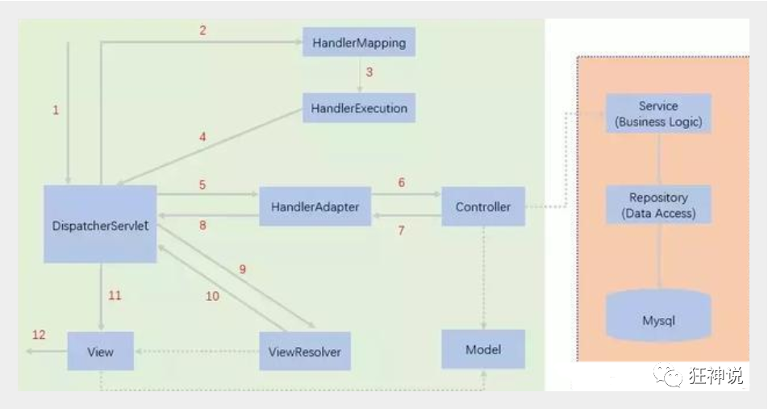
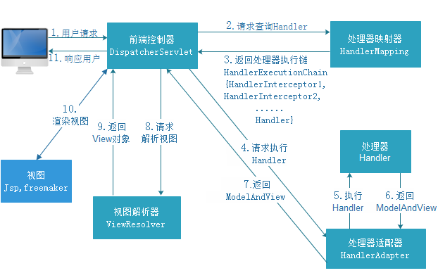
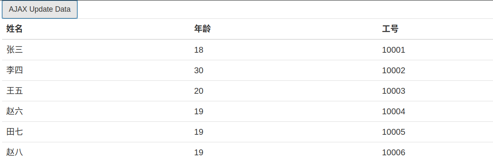

# MVC

## MVC概念

+ MVC是模型(Model)、视图(View)、控制器(Controller)的简写，是一种软件设计规范。
+ 是将业务逻辑、数据、显示分离的方法来组织代码。
+ MVC主要作用是**降低了视图与业务逻辑间的双向偶合**。
+ MVC不是一种设计模式，**MVC是一种架构模式**。当然不同的MVC存在差异。


## Model

> 是应用程序中用于处理应用程序数据逻辑的部分。通常模型对象负责在数据库中存取数据。 
>
> 数据模型，提供要展示的数据，因此包含数据和行为，可以认为是领域模型或JavaBean组件（包含数据和行为），不过现在一般都分离开来：Value Object（数据Dao） 和 服务层（行为Service）。也就是模型提供了模型数据查询和模型数据的状态更新等功能，包括数据和业务。


## View

> 是应用程序中处理数据显示的部分。通常视图是依据模型数据创建的。
>
> 负责进行模型的展示，一般就是我们见到的用户界面，客户想看到的东西。


## Controller

> 是应用程序中处理用户交互的部分。通常控制器负责从视图读取数据，控制用户输入，并向模型发送数据。
>
> 接收用户请求，委托给模型进行处理（状态改变），处理完毕后把返回的模型数据返回给视图，由视图负责展示。也就是说控制器做了个调度员的工作。


## Model 1

- Model1中，主要分为两层，视图层和模型层。
- 优点：
    - 架构简单，适合小型项目开发
- 缺点：
    - JSP职责不单一，职责过重一边承担业务逻辑一边承担用户响应，代码耦合严重，不便于维护。


## Model 2

+ Model2中，主要分为三层，模型层、视图层、控制层
+ 执行过程：
    + 用户发送请求
    + Servlet接受请求数据，并调用相应的业务代码
    + 业务层处理完毕，返回相应数据给Servlet
    + Servlet转向JSP，由JSP渲染界面
    + 响应给前端更新后的页面
+ 职责分析：
    + Controller
        + 获取用户请求数据
        + 调度业务代码
        + 控制转发重定向页面
    + Model
        + 处理数据库业务逻辑
        + 保存数据的状态
    + View
        + 显示页面


> 总结：
>
> ​		Model2这样不仅提高的代码的复用率与项目的扩展性，且大大降低了项目的维护成本。Model 1模式的实现比较简单，适用于快速开发小规模项目，Model1中JSP页面身兼View和Controller两种角色，将控制逻辑和表现逻辑混杂在一起，从而导致代码的重用性非常低，增加了应用的扩展性和维护的难度。Model2消除了Model1的缺点。


# Servlet 回顾

## 1、新建一个Maven工程作为父工程，并添加依赖

```xml
<dependencies>
    <dependency>
        <groupId>junit</groupId>
        <artifactId>junit</artifactId>
        <version>4.12</version>
    </dependency>
    <dependency>
        <groupId>org.springframework</groupId>
        <artifactId>spring-webmvc</artifactId>
        <version>5.1.9.RELEASE</version>
    </dependency>
    <dependency>
        <groupId>javax.servlet</groupId>
        <artifactId>servlet-api</artifactId>
        <version>2.5</version>
    </dependency>
    <dependency>
        <groupId>javax.servlet.jsp</groupId>
        <artifactId>jsp-api</artifactId>
        <version>2.2</version>
    </dependency>
    <dependency>
        <groupId>javax.servlet</groupId>
        <artifactId>jstl</artifactId>
        <version>1.2</version>
    </dependency>
</dependencies>
```

## 2、新建Model、并添加Web App支持

+ 在Model上右键选中Add Framework Support
+ 选择Web


## 3、编写Servlet类，用来处理用户请求

```java
package com.zhang.servlet;

public class HelloServlet extends HttpServlet {
    public HelloServlet() {
    }

    protected void doGet(HttpServletRequest req, HttpServletResponse resp) throws ServletException, IOException {
        System.out.println("doget");
        String context = req.getParameter("context");
        if (!context.equals("") && context != null) {
            req.getSession().setAttribute("msg", context);
        }
        req.getRequestDispatcher("/WEB-INF/jsp/inputfrom.jsp").forward(req, resp);
    }

    protected void doPost(HttpServletRequest req, HttpServletResponse resp) throws ServletException, IOException {
        this.doGet(req, resp);
    }
}
```


## 4、编写web.xml，注册Servlet

```xml
<?xml version="1.0" encoding="UTF-8"?>
<web-app xmlns:xsi="http://www.w3.org/2001/XMLSchema-instance"
         xmlns="http://xmlns.jcp.org/xml/ns/javaee"
         xsi:schemaLocation="http://xmlns.jcp.org/xml/ns/javaee http://xmlns.jcp.org/xml/ns/javaee/web-app_4_0.xsd"
         version="4.0">
    <!--设置默认页面-->
    <welcome-file-list>
        <welcome-file>index.jsp</welcome-file>
    </welcome-file-list>

    <!--注册Servelt-->
    <servlet>
        <servlet-name>hello</servlet-name>
        <servlet-class>com.zhang.servlet.HelloServlet</servlet-class>
    </servlet>

    <!--url映射-->
    <servlet-mapping>
        <servlet-name>hello</servlet-name>
        <url-pattern>/hello</url-pattern>
    </servlet-mapping>
</web-app>
```


## 5、编写JSP页面

在WEB-INF文件夹下创建jsp文件夹，并创建jsp页面

```html
<%@ page contentType="text/html;charset=UTF-8" language="java" %>
<html>
<head>
    <title>Title</title>
</head>
<body>
    <h1>${msg}</h1>
</body>
</html>
```


## 6、启动Tomcat、测试页面


# Spring MVC概述 


## Spring MVC特点

+ 轻量级，简单易学
+ 高效 , 基于请求响应的MVC框架
+ 与Spring兼容性好，无缝结合
+ 约定优于配置
+ 功能强大：RESTful、数据验证、格式化、本地化、主题等
+ 简洁灵活


## 中心控制器

+ Spring的web框架围绕**DispatcherServlet** [ 调度Servlet ] 设计。

+ DispatcherServlet的作用是将请求分发到不同的处理器。


> Spring MVC框架像许多其他MVC框架一样, **以请求为驱动** , **围绕一个中心Servlet分派请求及提供其他功能**，**DispatcherServlet是一个实际的Servlet (它继承自HttpServlet 基类)**。


## Spring MVC 原理

> 当发起请求时被前置的控制器拦截到请求，根据请求参数生成代理请求，找到请求对应的实际控制器，控制器处理请求，创建数据模型，访问数据库，将模型响应给中心控制器，控制器使用模型与视图渲染视图结果，将结果返回给中心控制器，再将结果返回给请求者。


## SpringMVC执行原理






图为SpringMVC的一个较完整的流程图，实线表示SpringMVC框架提供的技术，不需要开发者实现，虚线表示需要开发者实现。


**简要分析执行流程**

1. DispatcherServlet表示前置控制器，是整个SpringMVC的控制中心。用户发出请求，DispatcherServlet接收请求并拦截请求。

    + 我们假设请求的url为 : http://localhost:8080/SpringMVC/hello

    + **如上url拆分成三部分：**
        + http://localhost:8080服务器域名
        + SpringMVC是部署在服务器上的web站点
        + hello表示控制器

    + 通过分析，如上url表示为：请求位于服务器localhost:8080上的SpringMVC站点的hello控制器。

2. HandlerMapping为处理器映射。DispatcherServlet调用HandlerMapping,HandlerMapping根据请求url查找Handler。

3. HandlerExecution表示具体的Handler,其主要作用是根据url查找控制器，如上url被查找控制器为：hello。

4. HandlerExecution将解析后的信息传递给DispatcherServlet,如解析控制器映射等。

5. HandlerAdapter表示处理器适配器，其按照特定的规则去执行Handler。

6. Handler让具体的Controller执行。

7. Controller将具体的执行信息返回给HandlerAdapter,如ModelAndView。

8. HandlerAdapter将视图逻辑名或模型传递给DispatcherServlet。

9. DispatcherServlet调用视图解析器(ViewResolver)来解析HandlerAdapter传递的逻辑视图名。

10. 视图解析器将解析的逻辑视图名传给DispatcherServlet。

11. DispatcherServlet根据视图解析器解析的视图结果，调用具体的视图。

12. 最终视图呈现给用户。


# Hello Spring MVC

## 配置版

### 1、新建Model，添加Web支持


### 2、导入pom.xml依赖

```xml
<dependencies>
    <dependency>
        <groupId>junit</groupId>
        <artifactId>junit</artifactId>
        <version>4.12</version>
    </dependency>
    <dependency>
        <groupId>org.springframework</groupId>
        <artifactId>spring-webmvc</artifactId>
        <version>5.1.9.RELEASE</version>
    </dependency>
    <dependency>
        <groupId>javax.servlet</groupId>
        <artifactId>servlet-api</artifactId>
        <version>2.5</version>
    </dependency>
    <dependency>
        <groupId>javax.servlet.jsp</groupId>
        <artifactId>jsp-api</artifactId>
        <version>2.2</version>
    </dependency>
    <dependency>
        <groupId>javax.servlet</groupId>
        <artifactId>jstl</artifactId>
        <version>1.2</version>
    </dependency>
</dependencies>
```


### 3、配置web.xml，将DispatcherServlet注册到web.xml中

```xml
<?xml version="1.0" encoding="UTF-8"?>
<web-app xmlns:xsi="http://www.w3.org/2001/XMLSchema-instance"
         xmlns="http://xmlns.jcp.org/xml/ns/javaee"
         xsi:schemaLocation="http://xmlns.jcp.org/xml/ns/javaee http://xmlns.jcp.org/xml/ns/javaee/web-app_4_0.xsd"
         version="4.0">

    <!--1、注册DispatcherServlet-->
    <servlet>
        <servlet-name>springmvc</servlet-name>
        <servlet-class>org.springframework.web.servlet.DispatcherServlet</servlet-class>
        <!--关联一个springmvc的配置文件:【servlet-name】-servlet.xml-->
        <init-param>
            <param-name>contextConfigLocation</param-name>
            <param-value>classpath:springmvc-servlet.xml</param-value>
        </init-param>
        <!--设置启动级别-->
        <load-on-startup>1</load-on-startup>
    </servlet>

    <!--/ 匹配所有的请求；（不包括.jsp）-->
    <!--/* 匹配所有的请求；（包括.jsp）-->
    <servlet-mapping>
        <servlet-name>springmvc</servlet-name>
        <url-pattern>/</url-pattern>
    </servlet-mapping>
</web-app>
```


### 4、编写SpringMVC配置文件夹，springmvc-servlet.xml文件夹

```xml
<?xml version="1.0" encoding="UTF-8"?>
<beans xmlns:xsi="http://www.w3.org/2001/XMLSchema-instance"
       xmlns="http://www.springframework.org/schema/beans"
       xsi:schemaLocation="http://www.springframework.org/schema/beans
        https://www.springframework.org/schema/beans/spring-beans.xsd">

</beans>
```


### 5、在SpringMVC配置中添加 处理映射器

```xml
<bean class="org.springframework.web.servlet.handler.BeanNameUrlHandlerMapping"/>
```


### 6、在SpringMVC配置中添加 处理适配器

```xml
<bean class="org.springframework.web.servlet.mvc.SimpleControllerHandlerAdapter"/>
```


### 7、在SpringMVC配置中添加 视图解析器

```xml
<!--视图解析器:DispatcherServlet给他的ModelAndView-->
<bean class="org.springframework.web.servlet.view.InternalResourceViewResolver" id="InternalResourceViewResolver">
   <!--前缀-->
   <property name="prefix" value="/WEB-INF/jsp/"/>
   <!--后缀-->
   <property name="suffix" value=".jsp"/>
</bean>
```


**Spring MVC 配置代码**

```xml
<?xml version="1.0" encoding="UTF-8"?>
<beans xmlns:xsi="http://www.w3.org/2001/XMLSchema-instance"
       xmlns="http://www.springframework.org/schema/beans"
       xsi:schemaLocation="http://www.springframework.org/schema/beans
        https://www.springframework.org/schema/beans/spring-beans.xsd">

    <!--处理映射器-->
    <bean class="org.springframework.web.servlet.handler.BeanNameUrlHandlerMapping"/>
    <!--处理适配器-->
    <bean class="org.springframework.web.servlet.mvc.SimpleControllerHandlerAdapter"/>
    <!--视图解析器:DispatcherServlet给他的ModelAndView-->
    <bean class="org.springframework.web.servlet.view.InternalResourceViewResolver" id="InternalResourceViewResolver">
        <!--前缀-->
        <property name="prefix" value="/WEB-INF/jsp/"/>
        <!--后缀-->
        <property name="suffix" value=".jsp"/>
    </bean>
</beans>
```


### 8、编写操作业务Controller

> 编写我们要操作业务Controller ，要么实现Controller接口，要么增加注解；需要返回一个ModelAndView，装数据，封视图；

**注意Controller包**

```java
package com.zhang.controller;

import org.springframework.web.servlet.ModelAndView;
import org.springframework.web.servlet.mvc.Controller;
import javax.servlet.http.HttpServletRequest;
import javax.servlet.http.HttpServletResponse;

//导入Controller接口
public class HelloController implements Controller {
    public ModelAndView handleRequest(HttpServletRequest httpServletRequest, HttpServletResponse httpServletResponse) throws Exception {
        //ModelAndView 模型和视图
        ModelAndView mv = new ModelAndView();
        //封装对象，放在ModelAndView中。Model
        mv.addObject("msg", "HelloSpringMVC");
        //封装要跳转的视图，放在ModelAndView中
        mv.setViewName("hellojsp"); //: /WEB-INF/jsp/hello.jsp
        return mv;
    }
}
```


### 9、将自己编写得Controller类装配到Spring IOC容器中，注册Bean

类似web.xml中的servlet-mapping

```xml
<!--handler-->
<bean id="/hello" class="com.zhang.controller.HelloController"/>
```


### 10、编写JSP文件夹

在WEB-INF/JSP/路径下编写hellojsp.jsp文件夹

```html
<%@ page contentType="text/html;charset=UTF-8" language="java" %>
<html>
<head>
    <title>Title</title>
</head>
<body>
    <h1>${msg}</h1>
</body>
</html>
```


### 注意 404 排查

1. 查看控制台输出，看一下是不是缺少了什么jar包。
2. 如果jar包存在，显示无法输出，就在IDEA的项目发布中，添加lib依赖！
3. 重启Tomcat 即可解决！


## 注解版

### 1、前期准备与配置版相同

+ 新建model，添加web支持

+ 导入pom.xml依赖

    + 主要有Spring框架核心库、Spring MVC、servlet , JSTL等

+ 编写web.xml，注册DispatcherServlet

    ```xml
    <?xml version="1.0" encoding="UTF-8"?>
    <web-app xmlns:xsi="http://www.w3.org/2001/XMLSchema-instance"
             xmlns="http://xmlns.jcp.org/xml/ns/javaee"
             xsi:schemaLocation="http://xmlns.jcp.org/xml/ns/javaee http://xmlns.jcp.org/xml/ns/javaee/web-app_4_0.xsd"
             version="4.0">
    
        <!--1.注册servlet-->
        <servlet>
            <servlet-name>SpringMVC</servlet-name>
            <servlet-class>org.springframework.web.servlet.DispatcherServlet</servlet-class>
            <!--通过初始化参数指定SpringMVC配置文件的位置，进行关联-->
            <init-param>
                <param-name>contextConfigLocation</param-name>
                <param-value>classpath:springmvc-servlet.xml</param-value>
            </init-param>
            <!-- 启动顺序，数字越小，启动越早 -->
            <load-on-startup>1</load-on-startup>
        </servlet>
    
        <!--所有请求都会被springmvc拦截 -->
        <servlet-mapping>
            <servlet-name>SpringMVC</servlet-name>
            <url-pattern>/</url-pattern>
        </servlet-mapping>
    </web-app>
    ```

    

+ 在SpringMVC配置中添加视图解析器

    ```xml
    <!-- 视图解析器 -->
    <bean class="org.springframework.web.servlet.view.InternalResourceViewResolver"
          id="internalResourceViewResolver">
        <!-- 前缀 -->
        <property name="prefix" value="/WEB-INF/jsp/" />
        <!-- 后缀 -->
        <property name="suffix" value=".jsp" />
    </bean>
    ```

    


### 2、SpringMVC配置文件编写

+ 自动扫描包

    ```xml
    <context:component-scan base-package="com.kuang.controller"/>
    ```

+ 让SpringMVC不处理静态资源

    ```xml
    <mvc:default-servlet-handler />
    ```

+ 添加MVC注解驱动支持

    ```xml
    <!--
       支持mvc注解驱动
           在spring中一般采用@RequestMapping注解来完成映射关系
           要想使@RequestMapping注解生效
           必须向上下文中注册DefaultAnnotationHandlerMapping
           和一个AnnotationMethodHandlerAdapter实例
           这两个实例分别在类级别和方法级别处理。
           而annotation-driven配置帮助我们自动完成上述两个实例的注入。
        -->
    <mvc:annotation-driven />
    ```


#### SpringMVC-servlet.xml全代码

```xml
<?xml version="1.0" encoding="UTF-8"?>
<beans xmlns="http://www.springframework.org/schema/beans"
      xmlns:xsi="http://www.w3.org/2001/XMLSchema-instance"
      xmlns:context="http://www.springframework.org/schema/context"
      xmlns:mvc="http://www.springframework.org/schema/mvc"
      xsi:schemaLocation="http://www.springframework.org/schema/beans
       http://www.springframework.org/schema/beans/spring-beans.xsd
       http://www.springframework.org/schema/context
       https://www.springframework.org/schema/context/spring-context.xsd
       http://www.springframework.org/schema/mvc
       https://www.springframework.org/schema/mvc/spring-mvc.xsd">

   <!-- 自动扫描包，让指定包下的注解生效,由IOC容器统一管理 -->
   <context:component-scan base-package="com.zhang.controller"/>
   <!-- 让Spring MVC不处理静态资源 -->
   <mvc:default-servlet-handler />
   <!--
   支持mvc注解驱动
       在spring中一般采用@RequestMapping注解来完成映射关系
       要想使@RequestMapping注解生效
       必须向上下文中注册DefaultAnnotationHandlerMapping
       和一个AnnotationMethodHandlerAdapter实例
       这两个实例分别在类级别和方法级别处理。
       而annotation-driven配置帮助我们自动完成上述两个实例的注入。
    -->
   <mvc:annotation-driven />

   <!-- 视图解析器 -->
   <bean class="org.springframework.web.servlet.view.InternalResourceViewResolver"
         id="internalResourceViewResolver">
       <!-- 前缀 -->
       <property name="prefix" value="/WEB-INF/jsp/" />
       <!-- 后缀 -->
       <property name="suffix" value=".jsp" />
   </bean>

</beans>
```


在视图解析器中我们把所有的视图都存放在/WEB-INF/目录下，这样可以保证视图安全，因为这个目录下的文件，客户端不能直接访问。
### 3、创建Controller

**编写一共Controller控制类**，com.kuang.controller.HelloController

```java
package com.zhang.controller;

import org.springframework.stereotype.Controller;
import org.springframework.ui.Model;
import org.springframework.web.bind.annotation.RequestMapping;

/**
 * @author zhang
 * 是为了让Spring IOC容器初始化时自动扫描到；
 */
@Controller
public class HelloController {

    //真实访问地址 : 项目名/HelloController/hello
    @RequestMapping("/hello")
    //方法中声明Model类型的参数是为了把Action中的数据带到视图中；
    public String Hello(Model model) {
        //向模型中添加属性msg与值，可以在JSP页面中取出并渲染
        model.addAttribute("msg", "HelloMVC");
        //方法返回的结果是视图的名称hello，加上配置文件中的前后缀变成  web-inf/jsp/hello.jsp
        return "hello";
    }
}
```


### 4、编写视图

**在WEB-INF/jsp/下创建jsp文件**

+ 视图中可以直接取出从Controller带回的值
+ 可以通过EL表示取出Model中存放的值，或者对象；

```html
<%@ page contentType="text/html;charset=UTF-8" language="java" %>
<html>
<head>
    <title>Title</title>
</head>
<body>
<h1>${msg}</h1>
</body>
</html>
```


### 5、配置Tomcat运行


## 总结

实现步骤

1. 新建一个web项目
2. 导入相关jar包
3. 编写web.xml , 注册DispatcherServlet
4. 编写springmvc配置文件
5. 接下来就是去创建对应的控制类 , controller
6. 最后完善前端视图和controller之间的对应
7. 测试运行调试.


使用springMVC必须配置的三大件：

+ **处理器映射器、处理器适配器、视图解析器**

>  通常，我们只需要**手动配置视图解析器**，而**处理器映射器**和**处理器适配器**只需要开启**注解驱动**即可，而省去了大段的xml配置


# Controller

- 控制器复杂提供访问应用程序的行为，通常通过接口定义或注解定义两种方法实现。
- 控制器负责解析用户的请求并将其转换为一个模型。
- 在Spring MVC中一个控制器类可以包含多个方法
- 在Spring MVC中，对于Controller的配置方式有很多种


## 实现控制器方法

+ **Controller**是一个由Spring MVC所定义的接口，org.springframework.web.servlet.mvc包下，接口中只有一个方法
+ 实现该接口的类将获得控制器功能类似Servlet

```java
//实现该接口的类获得控制器功能
public interface Controller {
   //处理请求且返回一个模型与视图对象
   ModelAndView handleRequest(HttpServletRequest var1, HttpServletResponse var2) throws Exception;
}
```


## @Controller

+ @Controller注解类型用于声明Spring类的实例是一个控制器（在讲IOC时还提到了另外3个注解）
+ Spring可以使用扫描机制来找到应用程序中所有基于注解的控制器类，为了保证Spring能找到你的控制器，需要在配置文件中声明组件扫描。


通过Spring MVC xml配置文件中，这个注解会使Spring自动扫描，并交由IOC容器进行统一管理

```xml
<!-- 自动扫描指定的包，下面所有注解类交给IOC容器管理 -->
<context:component-scan base-package="com.kuang.controller"/>
```


## @RequestMapping说明

+ @RequestMapping注解用于映射URL到控制器类或者指定的处理程序方法。

+ 用于类上表示所有响应的请求的方法都是该地址作为父路径

    ```java
    @Controller
    @RequestMapping("HelloController/")
    public class HelloController {
        //真实访问地址 : 项目名/HelloController/hello
        @RequestMapping("/hello") //   HelloController/hello
        //方法中声明Model类型的参数是为了把Action中的数据带到视图中；
        public String Hello(Model model) {
            //向模型中添加属性msg与值，可以在JSP页面中取出并渲染
            model.addAttribute("msg", "HelloMVC");
            //方法返回的结果是视图的名称hello，加上配置文件中的前后缀变成  web-inf/jsp/hello.jsp
            return "hello";
        }
    }
    ```

+ 只注解在方法上

    ```java
    @Controller
    public class HelloController {
        //真实访问地址 : 项目名/hello
        @RequestMapping("/hello") //   /hello
        public String Hello(Model model) {
            model.addAttribute("msg", "HelloMVC");
            return "hello";
        }
    }
    ```

+ 同时注解在类和方法上

    ```java
    @Controller
    @RequestMapping("HelloController/")
    public class HelloController {
        //真实访问地址 : 项目名/HelloController/hello
        @RequestMapping("/hello") //   HelloController/hello
        public String Hello(Model model) {
            model.addAttribute("msg", "HelloMVC");
            return "hello";
        }
    }
    ```

    

**代替了SpringMVC xml中配置代码**

```xml
<!--handler-->
<bean id="/hello" class="com.zhang.controller.HelloController"/>
```


## RESTful

### 概念

> RESTFUL是一种网络应用程序的设计风格和开发方式，基于[HTTP](https://baike.baidu.com/item/HTTP/243074)，可以使用[XML](https://baike.baidu.com/item/XML/86251)格式定义或[JSON](https://baike.baidu.com/item/JSON/2462549)格式定义。RESTFUL适用于移动互联网厂商作为业务使能接口的场景，实现第三方[OTT](https://baike.baidu.com/item/OTT/9960940)调用移动网络资源的功能，动作类型为新增、变更、删除所调用资源
>
>  
>
> RESTful就是一个资源定位以及资源操作的风格。不是标准也不是协议，只是一种风。基于这种风格可以让代码更加简洁，更有层次，更容易实现缓存等机制。


### 作用

资源：互联网所有的事物都可以被抽象为资源

资源操作：使用POST、DELETE、PUT、GET，使用不同方法对资源进行操作。

分别对应 添加、 删除、修改、查询。


**传统方式操作资源**  ：通过不同的参数来实现不同的效果！方法单一，post 和 get

​	http://127.0.0.1/item/queryItem.action?id=1 查询,GET

​	http://127.0.0.1/item/saveItem.action 新增,POST

​	http://127.0.0.1/item/updateItem.action 更新,POST

​	http://127.0.0.1/item/deleteItem.action?id=1 删除,GET或POST


**使用RESTful操作资源** ：可以通过不同的请求方式来实现不同的效果！如下：请求地址一样，但是功能可以不同！

​	http://127.0.0.1/item/1 查询,GET

​	http://127.0.0.1/item 新增,POST

​	http://127.0.0.1/item 更新,PUT

​	http://127.0.0.1/item/1 删除,DELETE


```java
@Controller
public class RestfulController {
    @RequestMapping(value = "/add/{a}/{b}")
    public String helloAdd(@PathVariable int a, @PathVariable int b, Model model) { //PathVariable注解可以同步前端url传输的数据名
        //int c = a + b;
        model.addAttribute("msg", a + b);
        return "add";
    }
}

```


# 数据处理及跳转

## 结果跳转方法

### 1、ServletAPI

+ 通过设置ServletAPI，**不需要**视图解析器配置。

+ 通过HttpServeltResponse进行设置可以实现：

    + 重定向
    + 转发

    ```java
    @Controller
    public class ResultGo {
    
       @RequestMapping("/result/t1")
       public void test1(HttpServletRequest req, HttpServletResponse rsp) throws IOException {
           rsp.getWriter().println("Hello,Spring BY servlet API");
      }
    
       @RequestMapping("/result/t2")
       public void test2(HttpServletRequest req, HttpServletResponse rsp) throws IOException {
           rsp.sendRedirect("/index.jsp"); //重定向
      }
    
       @RequestMapping("/result/t3")
       public void test3(HttpServletRequest req, HttpServletResponse rsp) throws Exception {
           //转发
           req.setAttribute("msg","/result/t3");
           req.getRequestDispatcher("/WEB-INF/jsp/test.jsp").forward(req,rsp);
      }
    }
    ```


### 2、ModelAndView

**设置ModelAndView对象**，根据view，和**视图解析器**（需要配置）跳转到指定页面。

页面跳转规则：{配置的视图解析器前缀} + viewName + {配置的视图解析器后缀}


SpringMVC配置中配置视图解析器:

```xml
<bean class="org.springframework.web.servlet.view.InternalResourceViewResolver" id="internalResourceViewResolver">
    <property name="prefix" value="/WEB-INF/jsp/"/>
    <property name="suffix" value=".jsp"/>
</bean>
```


对应示例的Controller

```java
@Controller
@RequestMapping("/t1")
public class ModelAndViewDemoController {
    @GetMapping("/t1")
    public ModelAndView test1() {
        ModelAndView modelAndView = new ModelAndView();
        //像前端传入数据msg
        modelAndView.addObject("msg", "t1 response message.");
        //视图解析器会拼接Viewname: /WEB-INF/jsp/test.jsp
        modelAndView.setViewName("test");
        return modelAndView;
    }

    @GetMapping("/t2")
    public ModelAndView test2(ModelAndView modelAndView) {
        modelAndView.addObject("msg", "t2 response message.");
        modelAndView.setViewName("test");
        return modelAndView;
    }
}
```


### 3、SpringMVC

#### 无视图解析器 实现转发和重定向

测试前注释掉SpringMVC配置中的视图解析器

```java
@Controller
@RequestMapping("/t2")
public class NullViewResolverController {
    @GetMapping("/1")
    public String test1(Model model) {
        model.addAttribute("msg", "NullViewResolverController test1");
        //转发
        return "/WEB-INF/jsp/test.jsp";
    }

    @GetMapping("/2")
    public String test2(Model model) {
        model.addAttribute("msg", "NullViewResolverController test2");
        //转发
        return "forward:/WEB-INF/jsp/test.jsp";
    }

    @GetMapping("/3")
    public String test3() {
        //重定向
        return "redirect:/index.jsp";
    }
}
```


#### 有视图解析器 实现转发和重定向

视图解析器配置：

```xml
<bean class="org.springframework.web.servlet.view.InternalResourceViewResolver" id="internalResourceViewResolver">
    <property name="prefix" value="/WEB-INF/jsp/"/>
    <property name="suffix" value=".jsp"/>
</bean>
```


重定向

+ 不需要视图解析器，本质上就是一个重新请求新地方
+ 注意路径问题


```java
@Controller
@RequestMapping("/t3")
public class ViewResolverController {

    @GetMapping("/t1")
    public String test1(Model model) {
        model.addAttribute("msg", "ViewResolverController test1");
        //默认即是转发
        return "test";
    }

    @GetMapping("/t2")
    public String test2() {
        // /t3/t1.do 重定向到另一个请求上
        //return "redirect:/t3/t1.do";
        //重定向
        return "redirect:/index.jsp";
    }
}
```


## 数据处理

### 处理用户提交的数据

#### 1、前端提交参数名一致

提交数据：http://localhost:8080/hello?username=zhang

处理方法 :

```java
@RequestMapping("/hello")
public String hello(String name){
   System.out.println(name);
   return "hello";
}
```


#### 2、前端提交参数名不一致

提交数据：http://localhost:8080/hello?username=zhang

处理方法 :

```java
//@RequestParam("username") : username提交的域的名称 .
@RequestMapping("/hello")
public String hello(@RequestParam("username") String name){
   System.out.println(name);
   return "hello";
}
```


#### 3、前端提交的是一个对象

**要求**提交的表单域和**对象的属性名一致**  , 参数使用对象即可

实体类：

```java
//pojo
public class User {
    private int id;
    private String name;
    private int age;
    //构造
    //get/set
    //tostring()
}
```

提交数据：http://localhost:8080/mvc04/user?name=zhang&id=1&age=15

处理方法：

```java
@RequestMapping("/user")
public String user(User user){
    System.out.println(user);
    return "hello";
}
```

> 如果使用对象的话，前端传递的参数名和对象名必须一致，否则就是null


### 后端数据显示到前端

#### 1、通过ModelAndView

```java
public class ControllerTest1 implements Controller {
    public ModelAndView handleRequest(HttpServletRequest httpServletRequest, HttpServletResponse httpServletResponse) throws Exception {
        //返回一个模型视图对象
        ModelAndView mv = new ModelAndView();
        mv.addObject("msg","ControllerTest1");
        mv.setViewName("test");
        return mv;
    }
}
```


#### 2、通过Model

```java
@Controller
@RequestMapping("/t3")
public class ViewResolverController {

    @GetMapping("/t1")
    public String test1(Model model) {
        model.addAttribute("msg", "ViewResolverController test1");
        //默认即是转发
        return "test";
    }
}
```


#### 3、通过ModelMap

```java
@RequestMapping("/hello")
public String hello(@RequestParam("username") String name, ModelMap model){
   //封装要显示到视图中的数据
   //相当于req.setAttribute("name",name);
   model.addAttribute("name",name);
   System.out.println(name);
   return "hello";
}
```


### Model、ModelAndView、ModelMap对比

+ Model
    + 只有几个用于存储数据的方法，简化对Model对象的操作和理解
+ ModelMap
    + 继承LinkedMap，实现Model的同时，继承LinkedMap的操作和特性
+ ModelAndView
    + 存储数据
    + 设置返回视图的逻辑，控制View的跳转


# 乱码问题

## Tomcat修改编码

```xml
//C:\Program Files\Apache Software Foundation\apache-tomcat-9.0.16\confserver.xml
<Connector URIEncoding="utf-8" port="8080" protocol="HTTP/1.1"
           connectionTimeout="20000"
           URLEncoding="UTF-8"
           redirectPort="8443" />
```


## Servlet过滤器解决


## SpringMVC过滤器解决

JSP: /WEB-INF/jsp/input.jsp

```html
<%@ page contentType="text/html;charset=UTF-8" language="java" %>
<html>
<head>
    <title>Title</title>
</head>
<body>
<form method="post" action="/test">
    <input type="text" name="username"/>
    <input type="submit" value="提交"/>
</form>
</body>
</html>
```

JSP: /index.jsp

```xml
<%@ page contentType="text/html;charset=UTF-8" language="java" %>
<html>
  <head>
    <title>$Title$</title>
  </head>
  <body>
  $END$ ${msg}
  </body>
</html>
```

Controller:

```java
@Controller
public class TestController {
    @GetMapping("/input")
    public String input1() {
        return "input";
    }

    @PostMapping("/test")
    public String test1(@RequestParam("username") String name, Model model) {
        System.out.println(name);
        model.addAttribute("msg", name);
        return "../../index";
    }
}

```

在web.xml中配置SpringMVC过滤器：

```xml
<!--spring自带过滤器-->
<filter>
    <filter-name>encoding</filter-name>
    <filter-class>org.springframework.web.filter.CharacterEncodingFilter</filter-class>
    <init-param>
        <param-name>encoding</param-name>
        <param-value>utf-8</param-value>
    </init-param>
</filter>
<!--过滤/* 包括jsp文件-->
<filter-mapping>
    <filter-name>encoding</filter-name>
    <url-pattern>/*</url-pattern>
</filter-mapping>
```


## 自定义过滤器

```java
package com.kuang.filter;

import javax.servlet.*;
import javax.servlet.http.HttpServletRequest;
import javax.servlet.http.HttpServletRequestWrapper;
import javax.servlet.http.HttpServletResponse;
import java.io.IOException;
import java.io.UnsupportedEncodingException;
import java.util.Map;

/**
* 解决get和post请求 全部乱码的过滤器
*/
public class GenericEncodingFilter implements Filter {

    @Override
    public void destroy() {
    }

    @Override
    public void doFilter(ServletRequest request, ServletResponse response, FilterChain chain) throws IOException, ServletException {
        //处理response的字符编码
        HttpServletResponse myResponse=(HttpServletResponse) response;
        myResponse.setContentType("text/html;charset=UTF-8");

        // 转型为与协议相关对象
        HttpServletRequest httpServletRequest = (HttpServletRequest) request;
        // 对request包装增强
        HttpServletRequest myrequest = new MyRequest(httpServletRequest);
        chain.doFilter(myrequest, response);
    }

    @Override
    public void init(FilterConfig filterConfig) throws ServletException {
    }

}

//自定义request对象，HttpServletRequest的包装类
class MyRequest extends HttpServletRequestWrapper {

    private HttpServletRequest request;
    //是否编码的标记
    private boolean hasEncode;
    //定义一个可以传入HttpServletRequest对象的构造函数，以便对其进行装饰
    public MyRequest(HttpServletRequest request) {
        super(request);// super必须写
        this.request = request;
    }

    // 对需要增强方法 进行覆盖
    @Override
    public Map getParameterMap() {
        // 先获得请求方式
        String method = request.getMethod();
        if (method.equalsIgnoreCase("post")) {
            // post请求
            try {
                // 处理post乱码
                request.setCharacterEncoding("utf-8");
                return request.getParameterMap();
            } catch (UnsupportedEncodingException e) {
                e.printStackTrace();
            }
        } else if (method.equalsIgnoreCase("get")) {
            // get请求
            Map<String, String[]> parameterMap = request.getParameterMap();
            if (!hasEncode) { // 确保get手动编码逻辑只运行一次
                for (String parameterName : parameterMap.keySet()) {
                    String[] values = parameterMap.get(parameterName);
                    if (values != null) {
                        for (int i = 0; i < values.length; i++) {
                            try {
                                // 处理get乱码
                                values[i] = new String(values[i]
                                                       .getBytes("ISO-8859-1"), "utf-8");
                            } catch (UnsupportedEncodingException e) {
                                e.printStackTrace();
                            }
                        }
                    }
                }
                hasEncode = true;
            }
            return parameterMap;
        }
        return super.getParameterMap();
    }

    //取一个值
    @Override
    public String getParameter(String name) {
        Map<String, String[]> parameterMap = getParameterMap();
        String[] values = parameterMap.get(name);
        if (values == null) {
            return null;
        }
        return values[0]; // 取回参数的第一个值
    }

    //取所有值
    @Override
    public String[] getParameterValues(String name) {
        Map<String, String[]> parameterMap = getParameterMap();
        String[] values = parameterMap.get(name);
        return values;
    }
}
```


# JSON交互处理

## JSON概述

- JSON(JavaScript Object Notation, JS 对象标记) 是一种轻量级的数据交换格式，目前使用特别广泛。
- 采用完全独立于编程语言的**文本格式**来存储和表示数据。
- 简洁和清晰的层次结构使得 JSON 成为理想的数据交换语言。
- 易于人阅读和编写，同时也易于机器解析和生成，并有效地提升网络传输效率。


在 JavaScript 语言中，一切都是对象。因此，任何JavaScript 支持的类型都可以通过 JSON 来表示，例如字符串、数字、对象、数组等。看看他的要求和语法格式：

- 对象表示为键值对，数据由逗号分隔
- 花括号保存对象
- 方括号保存数组


## Controller返回JSON数据

@RestController

> 类上直接使用 **@RestController** ，这样子，里面所有的方法都只会返回 json 字符串了，不用再每一个都添加@ResponseBody 


### Jackson

#### 1、导入依赖

```xml
<dependency>
    <groupId>com.fasterxml.jackson.core</groupId>
    <artifactId>jackson-databind</artifactId>
    <version>2.10.3</version>
</dependency>
```


#### 2、项目添加Web支持


#### 3、配置web.xml

```xml
<?xml version="1.0" encoding="UTF-8"?>
<web-app xmlns:xsi="http://www.w3.org/2001/XMLSchema-instance"
         xmlns="http://xmlns.jcp.org/xml/ns/javaee"
         xsi:schemaLocation="http://xmlns.jcp.org/xml/ns/javaee http://xmlns.jcp.org/xml/ns/javaee/web-app_4_0.xsd"
         version="4.0">

    <!--注册spring servelt-->
    <servlet>
        <servlet-name>springmvc</servlet-name>
        <servlet-class>org.springframework.web.servlet.DispatcherServlet</servlet-class>
        <init-param>
            <param-name>contextConfigLocation</param-name>
            <!--引入配置文件-->
            <param-value>classpath:spring/springmvc-servlet.xml</param-value>
        </init-param>
        <!--设置启动顺序-->
        <load-on-startup>1</load-on-startup>
    </servlet>

    <!--所有请求都会被spring servlet拦截-->
    <!--*.jsp除外-->
    <servlet-mapping>
        <servlet-name>springmvc</servlet-name>
        <url-pattern>/</url-pattern>
    </servlet-mapping>

    <filter>
        <filter-name>encoding</filter-name>
        <filter-class>org.springframework.web.filter.CharacterEncodingFilter</filter-class>
        <init-param>
            <param-name>encoding</param-name>
            <param-value>utf-8</param-value>
        </init-param>
    </filter>

    <filter-mapping>
        <filter-name>encoding</filter-name>
        <url-pattern>/</url-pattern>
    </filter-mapping>
</web-app>
```


#### 4、配置springmvc-servlet.xml文件（springmvc配置）

```xml
<?xml version="1.0" encoding="UTF-8"?>
<beans xmlns:xsi="http://www.w3.org/2001/XMLSchema-instance"
       xmlns:context="http://www.springframework.org/schema/context"
       xmlns:mvc="http://www.springframework.org/schema/mvc" xmlns="http://www.springframework.org/schema/beans"
       xsi:schemaLocation="http://www.springframework.org/schema/beans
                           https://www.springframework.org/schema/beans/spring-beans.xsd http://www.springframework.org/schema/context https://www.springframework.org/schema/context/spring-context.xsd http://www.springframework.org/schema/mvc https://www.springframework.org/schema/mvc/spring-mvc.xsd">
    <!--开启包扫描 controller 下面的包交由ioc容器进行管理-->
    <context:component-scan base-package="com.zhang.controller"/>
    <!--让springmvc不处理静态资源-->
    <mvc:default-servlet-handler/>
    <!--开启springmvc注解支持-->
    <mvc:annotation-driven/>

    <!--设置视图解析器-->
    <bean class="org.springframework.web.servlet.view.InternalResourceViewResolver" id="internalResourceViewResolver">
        <!--前缀-->
        <property name="prefix" value="/WEB-INF/jsp/"/>
        <!--后缀-->
        <property name="suffix" value=".jsp"/>
    </bean>
</beans>
```


#### 5、创建演示实体类User

```java
package com.zhang.pojo;

public class User {
    private int id;
    private String name;
    private int age;

    //init setter and getter toString
}

```


#### 6、创建对应Controller

> @ResponseBody
>
> + 将java对象转为json格式的数据
> + 作用域：方法
> + 不会再走视图处理器，而是直接将数据写入到输入流
>
> ObjectMapper对象
>
> + jackson内置类

```java
@Controller
public class JsonControoler {
    @GetMapping("/json1")
    @ResponseBody
    public String getJson1() throws JsonProcessingException {
        ObjectMapper objectMapper = new ObjectMapper();
        return objectMapper.writeValueAsString(new User(1, "张三", 20));
    }
}
```

浏览器：


#### 7、处理乱码问题

需要设置编码UTF-8

```java
@Controller
public class JsonControoler {
    @RequestMapping(value = "/json1",produces = "application/json;charset=utf-8")
    @ResponseBody
    public String getJson1() throws JsonProcessingException {
        ObjectMapper objectMapper = new ObjectMapper();
        return objectMapper.writeValueAsString(new User(1, "张三", 20));
    }
}
```


#### 乱码统一解决

```JAVA
// 此方法比较麻烦 每条请求上都需要添加
@RequestMapping(value = "/json1",produces = "application/json;charset=utf-8")
```

> 可以通过SpringMVC配置统一指定编码
>
> 在配置文件中添加一段消息StringHttpMessageConverter转换配置

```XML
<?xml version="1.0" encoding="UTF-8"?>
<beans xmlns:xsi="http://www.w3.org/2001/XMLSchema-instance"
       xmlns:context="http://www.springframework.org/schema/context"
       xmlns:mvc="http://www.springframework.org/schema/mvc" xmlns="http://www.springframework.org/schema/beans"
       xsi:schemaLocation="http://www.springframework.org/schema/beans
        https://www.springframework.org/schema/beans/spring-beans.xsd http://www.springframework.org/schema/context https://www.springframework.org/schema/context/spring-context.xsd http://www.springframework.org/schema/mvc https://www.springframework.org/schema/mvc/spring-mvc.xsd">
    <!--开启包扫描 controller 下面的包交由ioc容器进行管理-->
    <context:component-scan base-package="com.zhang.controller"/>
    <!--让springmvc不处理静态资源-->
    <mvc:default-servlet-handler/>
    <!--开启springmvc注解支持-->
    <mvc:annotation-driven>
        <!--配置编码转换-->
        <mvc:message-converters register-defaults="true">
            <bean class="org.springframework.http.converter.StringHttpMessageConverter">
                <constructor-arg value="UTF-8"/>
            </bean>
            <bean class="org.springframework.http.converter.json.MappingJackson2HttpMessageConverter">
                <property name="objectMapper">
                    <bean class="org.springframework.http.converter.json.Jackson2ObjectMapperFactoryBean">
                        <property name="objectMapper" value="false"/>
                    </bean>
                </property>
            </bean>
        </mvc:message-converters>
    </mvc:annotation-driven>

    <!--设置视图解析器-->
    <bean class="org.springframework.web.servlet.view.InternalResourceViewResolver" id="internalResourceViewResolver">
        <!--前缀-->
        <property name="prefix" value="/WEB-INF/jsp/"/>
        <!--后缀-->
        <property name="suffix" value=".jsp"/>
    </bean>
</beans>
```


#### 测试集合转换

Controller:

```java
package com.zhang.controller;

@RestController
public class JsonControoler {
    @GetMapping("/json3")
    public String getJson3() throws JsonProcessingException {
        ObjectMapper objectMapper = new ObjectMapper();
        List<User> userList = new ArrayList<User>();
        userList.add(new User(1001, "张三", 20));
        userList.add(new User(1002, "李四", 20));
        userList.add(new User(1002, "王五", 20));
        userList.add(new User(1004, "赵六", 20));
        return objectMapper.writeValueAsString(userList);
    }
}

```


浏览器接收：


### Fastjson

#### 导入依赖

```xml
<dependency>
   <groupId>com.alibaba</groupId>
   <artifactId>fastjson</artifactId>
   <version>1.2.60</version>
</dependency>
```


# Ajax

## 概述

> - **AJAX = Asynchronous JavaScript and XML（异步的 JavaScript 和 XML）。**
> - AJAX 是一种在无需重新加载整个网页的情况下，能够更新部分网页的技术。
> - **Ajax 不是一种新的编程语言，而是一种用于创建更好更快以及交互性更强的Web应用程序的技术。**
> - 在 2005 年，Google 通过其 Google Suggest 使 AJAX 变得流行起来。Google Suggest能够自动帮你完成搜索单词。
> - Google Suggest 使用 AJAX 创造出动态性极强的 web 界面：当您在谷歌的搜索框输入关键字时，JavaScript 会把这些字符发送到服务器，然后服务器会返回一个搜索建议的列表。
> - 就和国内百度的搜索框一样!
>
> - 传统的网页(即不用ajax技术的网页)，想要更新内容或者提交一个表单，都需要重新加载整个网页。
> - 使用ajax技术的网页，通过在后台服务器进行少量的数据交换，就可以实现异步局部更新。
> - 使用Ajax，用户可以创建接近本地桌面应用的直接、高可用、更丰富、更动态的Web用户界面。


## Ajax作用

- 注册时，输入用户名自动检测用户是否已经存在。
- 登陆时，提示用户名密码错误
- 删除数据行时，将行ID发送到后台，后台在数据库中删除，数据库删除成功后，在页面DOM中将数据行也删除。
- ....等等


## Jquery.ajax

> Ajax的核心是XMLHttpRequest对象(XHR)。XHR为向服务器发送请求和解析服务器响应提供了接口。能够以异步方式从服务器获取新数据。
>
> 
>
> 利用Jquery实现前段向服务器进行Ajax请求


### 导入jquery

[微软CDN链接]("https://docs.microsoft.com/en-us/aspnet/ajax/cdn/overview#jQuery_Releases_on_the_CDN_0", "微软CDN")

> https://docs.microsoft.com/en-us/aspnet/ajax/cdn/overview#jQuery_Releases_on_the_CDN_0


### Jquery.ajax方法

```js
Query.ajax(...)
      部分参数：
            url：请求地址
            type：请求方式，GET、POST（1.9.0之后用method）
        headers：请求头
            data：要发送的数据
    contentType：即将发送信息至服务器的内容编码类型(默认: "application/x-www-form-urlencoded; charset=UTF-8")
          async：是否异步
        timeout：设置请求超时时间（毫秒）
      beforeSend：发送请求前执行的函数(全局)
        complete：完成之后执行的回调函数(全局)
        success：成功之后执行的回调函数(全局)
          error：失败之后执行的回调函数(全局)
        accepts：通过请求头发送给服务器，告诉服务器当前客户端可接受的数据类型
        dataType：将服务器端返回的数据转换成指定类型
          "xml": 将服务器端返回的内容转换成xml格式
          "text": 将服务器端返回的内容转换成普通文本格式
          "html": 将服务器端返回的内容转换成普通文本格式，在插入DOM中时，如果包含JavaScript标签，则会尝试去执行。
        "script": 尝试将返回值当作JavaScript去执行，然后再将服务器端返回的内容转换成普通文本格式
          "json": 将服务器端返回的内容转换成相应的JavaScript对象
        "jsonp": JSONP 格式使用 JSONP 形式调用函数时，如 "myurl?callback=?" jQuery 将自动替换 ? 为正确的函数名，以执行回调函数
```


## 示例

> 通过Jquery的ajax方法像服务端请求数据，前段接收后加载数据

### 1、搭建SpringMVC环境

+ 添加依赖
+ 设置WEB支持
+ 配置SpringMVC
+ 配置WEB.xml文件
+ 测试SpringMVC服务是否正常


### 2、编写JSP文件

> index.jsp

```html
<%@ page contentType="text/html;charset=UTF-8" language="java" %>
<html>
<head>
    <title>$Title$</title>
    <script src="${pageContext.request.contextPath}/static/js/jquery-3.5.0.js"></script>
    <link rel="stylesheet" href="https://cdn.jsdelivr.net/npm/bootstrap@3.3.7/dist/css/bootstrap.min.css"
          integrity="sha384-BVYiiSIFeK1dGmJRAkycuHAHRg32OmUcww7on3RYdg4Va+PmSTsz/K68vbdEjh4u" crossorigin="anonymous">
    <script>
        function a() {
            $.post({
                url: "${pageContext.request.contextPath}/t1",
                data: {'username': $("#search").val()},
                success: function (data, status) {
                    $('#msg').text(data + ":" + status);
                }
            })
        }
    </script>
</head>
<body>
<div style="width: 50%; margin: 0 auto;">
    <div class="form-group">
        <div class="col-sm-10">
            <input type="text" class="form-control" name="search" id="search" onblur="a()">
        </div>
    </div>
</div>
<h1 id="msg"></h1>

<a href="${pageContext.request.contextPath}/ajax" class="btn btn-default">跳转</a>
</body>
</html>
```


> jsp/ajaxJson.jsp

```html
<%@ page contentType="text/html;charset=UTF-8" language="java" %>
<html>

<head>
    <title>AjaxJson</title>
    <script src="${pageContext.request.contextPath}/static/js/jquery-3.5.0.js"></script>
    <link rel="stylesheet" href="https://cdn.jsdelivr.net/npm/bootstrap@3.3.7/dist/css/bootstrap.min.css"
        integrity="sha384-BVYiiSIFeK1dGmJRAkycuHAHRg32OmUcww7on3RYdg4Va+PmSTsz/K68vbdEjh4u" crossorigin="anonymous">
    <script>
        $(function () {
            $("#btn").click(function () {
                $.post("${pageContext.request.contextPath}/t2", function (data) {
                    var html = "";
                    data.forEach(e => {
                        html += "<tr>" + "<td>" + e.name + "</td>" + "<td>" + e.age + "</td>" + "<td>" + e.id + "</td>" + "</tr>";
                    });
                    $('#context').html(html);
                });
            })
        });
    </script>
</head>

<body>
    <div class="container">
        <div class="row">
            <button class="btn btn-default" id="btn">AJAX Update Data</button>
        </div>
        <div class="row">
            <table class="table table-hover">
                <tr>
                    <th>姓名</th>
                    <th>年龄</th>
                    <th>工号</th>
                </tr>
                <tbody id="context">

                </tbody>
            </table>
        </div>
    </div>
</body>

</html>
```


### 3、编写Controller控制器

> AjaxController：

```java
package com.zhang.controller;

@Controller
public class AjaxController {
    @PostMapping("/t1")
    @ResponseBody
    public String t1(@RequestParam("username") String name, Model model) {
        System.out.println("name:" + name);
        return "ajax:" + name;
    }

    @GetMapping("/ajax")
    public String ajax() {
        return "ajaxJson";
    }

    @RequestMapping("/t2")
    @ResponseBody
    public List<User> t2() {
        // 模拟数据库放回数据
        List<User> userList = new ArrayList<User>();
        userList.add(new User("张三", 18, 10001));
        userList.add(new User("李四", 30, 10002));
        userList.add(new User("王五", 20, 10003));
        userList.add(new User("赵六", 19, 10004));
        userList.add(new User("田七", 19, 10005));
        userList.add(new User("赵八", 19, 10006));
        return userList;
    }
}
```


### 4、Tomcat测试效果

输入框输入鼠标离开输入框，ajax请求数据库会返回一段处理过后的数据。用来模拟ajax请求。


点击按钮会更新数据到前段。




# 拦截器

## 概述

> SpringMVC的处理器拦截器类似于Servlet开发中的过滤器Filter,用于对处理器进行预处理和后处理。开发者可以自己定义一些拦截器来实现特定的功能。


## 过滤器与拦截器的区别

> 拦截器是AOP思想的具体应用。


**过滤器**

- servlet规范中的一部分，任何java web工程都可以使用
- 在url-pattern中配置了/*之后，可以对所有要访问的资源进行拦截

**拦截器** 

- 拦截器是SpringMVC框架自己的，只有使用了SpringMVC框架的工程才能使用
- 拦截器只会拦截访问的控制器方法， 如果访问的是jsp/html/css/image/js是不会进行拦截的


## 自定义拦截器

### 示例一：

#### 1、准备一个标准的SpringMVC　DEMO项目

+ 配置jar依赖
+ 配置SpringMVC配置
+ 配置web.xml文件
+ 测试是否成功搭建


#### 2、编写一个拦截器

```java
package com.zhang.interceptor;

public class MyInterceptor implements HandlerInterceptor {

   //在请求处理的方法之前执行
   //如果返回true执行下一个拦截器
   //如果返回false就不执行下一个拦截器
   public boolean preHandle(HttpServletRequest httpServletRequest, HttpServletResponse httpServletResponse, Object o) throws Exception {
       System.out.println("------------处理前------------");
       return true;
  }

   //在请求处理方法执行之后执行
   public void postHandle(HttpServletRequest httpServletRequest, HttpServletResponse httpServletResponse, Object o, ModelAndView modelAndView) throws Exception {
       System.out.println("------------处理后------------");
  }

   //在dispatcherServlet处理后执行,做清理工作.
   public void afterCompletion(HttpServletRequest httpServletRequest, HttpServletResponse httpServletResponse, Object o, Exception e) throws Exception {
       System.out.println("------------清理------------");
  }
}
```


#### 3、编写一个Controller、接收请求

```java
package com.zhang.controller;

//测试拦截器的控制器
@Controller
public class InterceptorController {

   @RequestMapping("/interceptor")
   @ResponseBody
   public String testFunction() {
       System.out.println("控制器中的方法执行了");
       return "hello";
  }
}
```


#### 4、在SpringMVC配置拦截器

```xml
<!--关于拦截器的配置-->
<mvc:interceptors>
   <mvc:interceptor>
       <!--/** 包括路径及其子路径-->
       <!--/admin/* 拦截的是/admin/add等等这种 , /admin/add/user不会被拦截-->
       <!--/admin/** 拦截的是/admin/下的所有-->
       <mvc:mapping path="/**"/>
       <!--bean配置的就是拦截器-->
       <bean class="com.kuang.interceptor.MyInterceptor"/>
   </mvc:interceptor>
</mvc:interceptors>
```


#### 5、前段index.jsp

```html
a href="${pageContext.request.contextPath}/interceptor">拦截器测试</a>
```


#### 6、Tomcat测试


### 实例二 验证用户登录 查看网页：

#### 预期效果：

拦截用户请求、如果用户没有登录跳转到登录页面、如果用户已经登录则跳转


#### 1、搭建环境

+ 项目添加WEB支持
+ 添加jar依赖
+ 添加springmvc配置
+ 添加web.xml配置
+ 测试


#### 2、添加相关jsp页面

结构：


代码：

```html
# index.jsp
<%@ page contentType="text/html;charset=UTF-8" language="java" %>
<html>
<head>
    <title>跳转页面</title>
</head>
<body>
<h3><a href="${pageContext.request.contextPath}/user/login">登录页面</a></h3>
<h3><a href="${pageContext.request.contextPath}/user/index">首页</a></h3>
</body>
</html>
    
    
# jsp/index.jsp 登录跳转的页面
<%@ page contentType="text/html;charset=UTF-8" language="java" %>
<html>
<head>
    <title>首页</title>
</head>
<body>
<div style="margin:0 auto;width: 100%;">
    </div>
</body>
</html>
    

# jsp/login.jsp 登录表单页面
<%@ page contentType="text/html;charset=UTF-8" language="java" %>
<html>
<head>
    <title>登录页面</title>
    <!-- 最新版本的 Bootstrap 核心 CSS 文件 -->
    <link rel="stylesheet" href="https://cdn.jsdelivr.net/npm/bootstrap@3.3.7/dist/css/bootstrap.min.css"
          integrity="sha384-BVYiiSIFeK1dGmJRAkycuHAHRg32OmUcww7on3RYdg4Va+PmSTsz/K68vbdEjh4u" crossorigin="anonymous">
</head>
<body>
<form action="${pageContext.request.contextPath}/user/actionlogin">
    <div class="form-group">
        <label>UserName:</label>
        <input type="text" name="username" required="required">
    </div>
    <div class="form-group">
        <label>Password:</label>
        <input type="password" name="password" required="required">
    </div>
    <button type="submit" class="btn btn-default">Submit</button>
</form>
</body>
</html>
```


#### 3、添加相应的Controller控制器

```java
package com.zhang.controller;

@Controller
@RequestMapping("/user")
public class InterceptorController {
    /**
     * @return 跳转到项目主页
     */
    @RequestMapping("/")
    public String rootIndex() {
        return "../../index";
    }

    /**
     * @return 跳转到User主页
     */
    @RequestMapping("/index")
    public String index() {
        return "index";
    }


    /**
     * @return 跳转到登录页面
     */
    @RequestMapping("/login")
    public String login() {
        return "login";
    }

    /**
     * 验证登录用户
     *
     * @return 跳转到user主页
     */
    @RequestMapping("/actionlogin")
    public String actionLogin(User user, HttpSession session) {
        System.out.println(getClass().getSimpleName() + "==" + "actionLogin()" + "==>" + user);
        session.setAttribute("user", user);
        return "index";
    }
}
```


#### 4、添加拦截器

```java
package com.zhang.config;

/**
 * 处理查看权限的拦截器
 */
public class UserInterceptor implements HandlerInterceptor {
    public boolean preHandle(HttpServletRequest request, HttpServletResponse response, Object handler) throws Exception {
        // 判断url中是否包含login，排除/login 和 /actionlogin请求
        if (request.getRequestURI().contains("login"))
            return true;
        // 如果用户已经登录就放行
        if (request.getSession().getAttribute("user") != null)
            return true;
        // 如果用户没有登录就跳转到登录页面
        request.getRequestDispatcher("/WEB-INF/jsp/login.jsp").forward(request, response);
        return false;
    }
}

```


#### 5、在SpringMVC配置中配置拦截器

```xml
<!--配置拦截器 用了AOP的方式-->
<mvc:interceptors>
    <mvc:interceptor>
        <mvc:mapping path="/**"/>
        <bean class="com.zhang.config.UserInterceptor"/>
    </mvc:interceptor>
</mvc:interceptors>
```


#### 6、Tomcat测试


# 文件上传和下载

